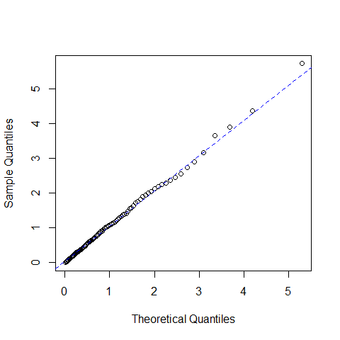
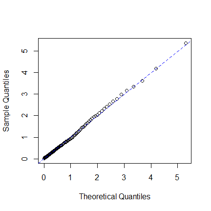

Example : emhawkes package
================
Kyungsub Lee
2023-02-02

## Basic Hawkes model

### Univariate Hawkes process

``` r
library(emhawkes)
```

This subsection outlines the steps for constructing, running
simulations, and estimating a univariate Hawkes model. To begin, create
an `hspec` object which defines the Hawkes model. S4 class `hspec`
contains slots for the model parameters: `mu`, `alpha`, `beta`,
`dimens`, `rmark`, and `impact`.

In a univariate model, the basic parameters of the model, `mu`, `alpha`,
`beta`, can be given as numeric. If numeric values are given, they will
be converted to matrices. Below is an example of a univariate Hawkes
model without a mark.

``` r
set.seed(1107)
mu1 <- 0.3; alpha1 <- 1.2; beta1 <- 1.5
hspec1 <- new("hspec", mu = mu1, alpha = alpha1, beta = beta1)
show(hspec1)
#> An object of class "hsepc" of 1-dimensional Hawkes process
#> 
#> Slot mu: 
#>      [,1]
#> [1,]  0.3
#> 
#> Slot alpha: 
#>      [,1]
#> [1,]  1.2
#> 
#> Slot beta: 
#>      [,1]
#> [1,]  1.5
```

The function `hsim` implements simulation where the input arguments are
`hspec`, `size` and the initial values of intensity component process,
`lambda_component0`, and the initial values of Hawkes processes, `N0`.
More precisely, the intensity process the basic univariate Hawkes model
is represented by
$$ \lambda(t) = \mu + \int_{-\infty}^t \alpha e^{-\beta (t-s)} d N(s) = \mu + \lambda_c(0) e^{-\beta t} + \int_0^t \alpha e^{-\beta (t-s)} d N(s) $$
where the `lambda_component0` denotes
$$ \lambda_c(0) = \int_{-\infty}^0 \alpha e^{\beta s} d N(s).$$ If
`lambda_component0` is not provided, the internally determined initial
values for intensity process are used. If `size` is sufficiently large,
exact value of `lambda_component0` may not be important. The default
initial value of counting process, `N0`, is zero.

``` r
res1 <- hsim(hspec1, size = 1000)
#> The initial values for intensity processes are not provided. Internally determined initial values are used for simulation.
summary(res1)
#> ------------------------------------------
#> Simulation result of marked Hawkes model.
#> Realized path :
#>        arrival N1 mark lambda1
#>  [1,]  0.00000  0    0 0.90000
#>  [2,]  0.97794  1    1 0.43838
#>  [3,]  1.09001  2    1 1.43128
#>  [4,]  1.28999  3    1 2.02711
#>  [5,]  1.53225  4    1 2.33527
#>  [6,]  1.65001  5    1 3.01139
#>  [7,]  2.51807  6    1 1.36377
#>  [8,]  2.81710  7    1 1.74553
#>  [9,]  2.87547  8    1 2.72378
#> [10,]  3.16415  9    1 2.65016
#> [11,]  3.51378 10    1 2.40131
#> [12,]  4.22355 11    1 1.43843
#> [13,] 16.96752 12    1 0.30000
#> [14,] 17.71654 13    1 0.69015
#> [15,] 19.10293 14    1 0.49874
#> [16,] 24.06354 15    1 0.30082
#> [17,] 24.09256 16    1 1.44967
#> [18,] 28.40173 17    1 0.30366
#> [19,] 28.53743 18    1 1.28198
#> [20,] 28.56702 19    1 2.38725
#> ... with 980 more rows 
#> ------------------------------------------
```

The results of `hsim` is an S3 class `hreal` which consists of `hspec`,
`inter_arrival`, `arrival`, `type`, `mark`, `N`, `Nc`, `lambda`,
`lambda_component`, `rambda`, `rambda_component`.

- `hspec` is the model specification

- `inter_arrival` is the inter-arrival time of every event

- `arrival` is the cumulative sum of `inter_arrival`

- `type` is the type of events, i.e., $i$ for $N_i$, and used for
  multivariate model

- `mark` is a numeric vector which represents additional information for
  the event

- `lambda` represents $\lambda$ which is the left continuous and right
  limit version

- The right continuous version of intensity is `rambda`

- `lambda_component` represents $\lambda_{ij}$ and `rambda_component` is
  the right continuous version.

`inter_arrival`, `type`, `mark`, `N`, and `Nc` start at zero. Using
`summary()` function, one can print the first 20 elements of `arrival`,
`N` and `lambda`. `print()` function also can be used.

By the definition, we have `lambda == mu + lambda_compoent`:

``` r
# first and third columns are the same
cbind(res1$lambda[1:5], res1$lambda_component[1:5], mu1 + res1$lambda_component[1:5])
#>          [,1]     [,2]     [,3]
#> [1,] 0.900000 0.600000 0.900000
#> [2,] 0.438383 0.138383 0.438383
#> [3,] 1.431282 1.131282 1.431282
#> [4,] 2.027111 1.727111 2.027111
#> [5,] 2.335269 2.035269 2.335269
```

Except the first row, `rambda == lambda + alpha` .

``` r
# second and third columns are the same
cbind(res1$lambda[1:5], res1$rambda[1:5], res1$lambda[1:5] + alpha1)
#>          [,1]     [,2]     [,3]
#> [1,] 0.900000 0.900000 2.100000
#> [2,] 0.438383 1.638383 1.638383
#> [3,] 1.431282 2.631282 2.631282
#> [4,] 2.027111 3.227111 3.227111
#> [5,] 2.335269 3.535269 3.535269
```

Also check the exponential decaying:

``` r
# By definition, the following two are equal:
res1$lambda[2:6]
#> [1] 0.438383 1.431282 2.027111 2.335269 3.011391
mu1 + (res1$rambda[1:5] - mu1) * exp(-beta1 * res1$inter_arrival[2:6])
#> [1] 0.438383 1.431282 2.027111 2.335269 3.011391
```

The log-likelihood function is computed by `logLik` method. In this
case, the inter-arrival times and `hspec` are inputs of the function.

``` r
logLik(hspec1, inter_arrival = res1$inter_arrival)
#> The initial values for intensity processes are not provided. Internally determined initial values are used.
#>           [,1]
#> [1,] -214.2385
```

The likelihood estimation is performed using `mhfit` function. The
specification of the initial values of the parameters, `hspec0` is
needed. Note that only `inter_arrival` is needed in this univariate
model. (Indeed, for more precise simulation, `lambda0`, the initial
value of lambda component, should be specified. If not, internally
determined initial values are used.) By default, it uses the BFGS method
for numerical optimization.

``` r
# initial value for numerical optimization
mu0 <- 0.5; alpha0 <- 1.0; beta0 <- 1.8
hspec0 <- new("hspec", mu = mu0, alpha = alpha0, beta = beta0)
# the intial values are provided through hspec
mle <- hfit(hspec0, inter_arrival = res1$inter_arrival)
#> The initial values for intensity processes are not provided. Internally determined initial values are used for estimation.
summary(mle)
#> --------------------------------------------
#> Maximum Likelihood estimation
#> BFGS maximization, 24 iterations
#> Return code 0: successful convergence 
#> Log-Likelihood: -213.4658 
#> 3  free parameters
#> Estimates:
#>        Estimate Std. error t value Pr(> t)    
#> mu1     0.33641    0.03486    9.65  <2e-16 ***
#> alpha1  1.16654    0.09980   11.69  <2e-16 ***
#> beta1   1.52270    0.13019   11.70  <2e-16 ***
#> ---
#> Signif. codes:  0 '***' 0.001 '**' 0.01 '*' 0.05 '.' 0.1 ' ' 1
#> --------------------------------------------
```

### Bivariate Hawkes model

The intensity process of basic bivariate Hawkes model is defined by

$$
 \lambda_1(t) = \mu_1 + \int_{-\infty}^t \alpha_{11} e^{-\beta_{11}(t-s)} d N_1(s) + \int_{-\infty}^t \alpha_{12} e^{-\beta_{12}(t-s)} d N_2(s),
$$

$$
 \lambda_2(t) = \mu_2 + \int_{-\infty}^t \alpha_{21} e^{-\beta_{21}(t-s)} d N_1(s) + \int_{-\infty}^t \alpha_{22} e^{-\beta_{22}(t-s)} d N_2(s).
$$

In a bivariate model, the parameters, the slots of `hspec`, are
matrices. `mu` is 2-by-1, and `alpha` and `beta` are 2-by-2 matrices:

$$
\mu = \begin{bmatrix} \mu_1 \\ \mu_2 \end{bmatrix}, \quad
\alpha = \begin{bmatrix} \alpha_{11} & \alpha_{12} \\ \alpha_{21} & \alpha_{22} \end{bmatrix}, \quad
\beta = 
\begin{bmatrix} \beta_{11} & \beta_{12} \\ \beta_{21} & \beta_{22} \end{bmatrix}
$$

`rmark` is a random number generating function for mark and is not used
for non-mark model. `lambda_component0`, 2-by-2 matrix, represents the
initial values of `lambda_component`, a set of
`lambda11, lambda12, lambda21, lambda22`. The intensity processes are
represented by

$$ \lambda_1(t) = \mu_1 + \lambda_{11}(t) + \lambda_{12}(t), $$

$$ \lambda_2(t) = \mu_2 + \lambda_{21}(t) + \lambda_{22}(t). $$

$\lambda_{ij}$ called lambda components and `lambda0` is
$\lambda_{ij}(0)$.

`lambda_component0` can be omitted and then internally determined
initial values are used.

``` r
mu2 <- matrix(c(0.2), nrow = 2)
alpha2 <- matrix(c(0.5, 0.9, 0.9, 0.5), nrow = 2, byrow = TRUE)
beta2 <- matrix(c(2.25, 2.25, 2.25, 2.25), nrow = 2, byrow = TRUE)
hspec2 <- new("hspec", mu=mu2, alpha=alpha2, beta=beta2)
print(hspec2)
#> An object of class "hsepc" of 2-dimensional Hawkes process
#> 
#> Slot mu: 
#>      [,1]
#> [1,]  0.2
#> [2,]  0.2
#> 
#> Slot alpha: 
#>      [,1] [,2]
#> [1,]  0.5  0.9
#> [2,]  0.9  0.5
#> 
#> Slot beta: 
#>      [,1] [,2]
#> [1,] 2.25 2.25
#> [2,] 2.25 2.25
```

To simulate, use function `hsim`.

``` r
res2 <- hsim(hspec2,  size=1000)
#> The initial values for intensity processes are not provided. Internally determined initial values are used for simulation.
summary(res2)
#> ------------------------------------------
#> Simulation result of marked Hawkes model.
#> Realized path :
#>        arrival N1 N2 mark lambda1 lambda2
#>  [1,]  0.00000  0  0    0 0.52941 0.52941
#>  [2,]  0.45174  1  0    1 0.31921 0.31921
#>  [3,]  1.08505  2  0    1 0.34893 0.44514
#>  [4,]  1.80625  3  0    1 0.32808 0.42601
#>  [5,]  5.85572  4  0    1 0.20007 0.20012
#>  [6,]  7.06679  4  1    1 0.23278 0.25901
#>  [7,]  7.29302  5  1    1 0.76068 0.53601
#>  [8,]  7.40387  5  2    1 1.02655 1.16317
#>  [9,]  7.41410  6  2    1 1.88724 1.62986
#> [10,]  7.44747  6  3    1 2.22904 2.36135
#> [11,]  7.51014  6  4    1 2.74383 2.51135
#> [12,]  7.67411  6  5    1 2.58131 2.14396
#> [13,] 10.80975  6  6    1 0.20283 0.20211
#> [14,] 20.12343  7  6    1 0.20000 0.20000
#> [15,] 27.36900  8  6    1 0.20000 0.20000
#> [16,] 27.71327  9  6    1 0.43044 0.61479
#> [17,] 29.31115 10  6    1 0.22005 0.23610
#> [18,] 30.38241 10  7    1 0.24669 0.28405
#> [19,] 31.85751 11  7    1 0.23426 0.22114
#> [20,] 32.02988 12  7    1 0.56251 0.82501
#> ... with 980 more rows 
#> ------------------------------------------
```

`type` is crucial in multi-variate models, which represents the type of
event.

``` r
# Under bi-variate model, there are two types, 1 or 2.
res2$type[1:10]
#>  [1] 0 1 1 1 1 2 1 2 1 2
```

The column names of `N` are `N1`, `N2`, `N3` and so on, for multivariate
models.

``` r
res2$N[1:3, ]
#>      N1 N2
#> [1,]  0  0
#> [2,]  1  0
#> [3,]  2  0
```

Similarly, the column names of `lambda` are `lambda1`, `lambda2`,
`lambda3` and so on.

``` r
res2$lambda[1:3, ]
#>        lambda1   lambda2
#> [1,] 0.5294118 0.5294118
#> [2,] 0.3192112 0.3192112
#> [3,] 0.3489332 0.4451416
```

The column names of `lambda_component` are `lambda_component11`,
`lambda_component12`, `lambda_component13` and so on.

``` r
res2$lambda_component[1:3, ]
#>        lambda11   lambda12   lambda21   lambda22
#> [1,] 0.11764706 0.21176471 0.21176471 0.11764706
#> [2,] 0.04257541 0.07663575 0.07663575 0.04257541
#> [3,] 0.13050071 0.01843250 0.23490128 0.01024028
```

By definition, the following two are the same:

``` r
mu2[1] + rowSums(res2$lambda_component[1:5, c("lambda11", "lambda12")])
#> [1] 0.5294118 0.3192112 0.3489332 0.3280770 0.2000693
res2$lambda[1:5, "lambda1"]
#> [1] 0.5294118 0.3192112 0.3489332 0.3280770 0.2000693
```

From the result, we get vectors of realized `inter_arrival` and `type`.
Bivariate model requires `inter_arrival` and `type` for estimation.

``` r
inter_arrival2 <- res2$inter_arrival
type2 <- res2$type
```

Log-likelihood is computed by a function `logLik`.

``` r
logLik(hspec2, inter_arrival = inter_arrival2, type = type2)
#> The initial values for intensity processes are not provided. Internally determined initial values are used.
#> [1] -1155.221
```

A maximum log-likelihood estimation is performed using `hfit`. In the
following, the values of parameter slots in `hspec0`, such as
`mu, alpha, beta`, serve as starting points of the numerical
optimization. For the purpose of illustration, we use
`hspec0 <- hspec2`. Since the true parameter values are not known in
practical applications, the initial guess is used. The realized
`inter_arrival` and `type` are used for estimation.

``` r
hspec0 <- hspec2
mle <- hfit(hspec0, inter_arrival = inter_arrival2, type = type2)
#> The initial values for intensity processes are not provided. Internally determined initial values are used for estimation.
summary(mle)
#> --------------------------------------------
#> Maximum Likelihood estimation
#> BFGS maximization, 35 iterations
#> Return code 0: successful convergence 
#> Log-Likelihood: -1153.699 
#> 4  free parameters
#> Estimates:
#>          Estimate Std. error t value  Pr(> t)    
#> mu1       0.19244    0.01457  13.209  < 2e-16 ***
#> alpha1.1  0.61305    0.07819   7.841 4.48e-15 ***
#> alpha1.2  0.88418    0.09465   9.342  < 2e-16 ***
#> beta1.1   2.29655    0.20506  11.199  < 2e-16 ***
#> ---
#> Signif. codes:  0 '***' 0.001 '**' 0.01 '*' 0.05 '.' 0.1 ' ' 1
#> --------------------------------------------
```

``` r
coef(mle)
#>       mu1  alpha1.1  alpha1.2   beta1.1 
#> 0.1924436 0.6130518 0.8841788 2.2965457
```

``` r
miscTools::stdEr(mle)
#>        mu1   alpha1.1   alpha1.2    beta1.1 
#> 0.01456893 0.07818747 0.09464793 0.20506267
```

### Parameter setting

This subsection covers about the relation between parameter setting and
estimation procedure in multi-variate Hawkes model. The number of
parameters to be estimated in the model depends on how we set the
parameter slots such as `mu`, `alpha` and `beta` in `hspec0`, the
specification for initial values. Since the parameter slot such as
`alpha` is a matrix, and the element in the matrix can be the same or
different. The number of parameters in the estimation varies depending
on whether or not some of the elements in the initial setting are the
same or different.

For example, if `alpha[1,1]` and `alpha[1,2]` in `hspec0` are different
in initial starting, the numerical procedure tries to estimate both
parameters of `alpha[1,1]` and `alpha[1,2]` differently. If `alpha[1,1]`
and `alpha[1,2]` are the same in the initial setting, then the
estimation procedure considered two parameters are identical in the
model and hence only one value is estimated.

Recall that the example in the previous section is of a symmetric Hawkes
model where the matrix `alpha` is symmetric. In addition, the elements
of `beta` are all the same.

``` r
print(hspec2)
#> An object of class "hsepc" of 2-dimensional Hawkes process
#> 
#> Slot mu: 
#>      [,1]
#> [1,]  0.2
#> [2,]  0.2
#> 
#> Slot alpha: 
#>      [,1] [,2]
#> [1,]  0.5  0.9
#> [2,]  0.9  0.5
#> 
#> Slot beta: 
#>      [,1] [,2]
#> [1,] 2.25 2.25
#> [2,] 2.25 2.25
```

``` r
res2 <- hsim(hspec2, size = 1000)
#> The initial values for intensity processes are not provided. Internally determined initial values are used for simulation.
```

In the first example of estimation, the initial value of `alpha0` is a
matrix where the all elements have the same value of 0.75. In this
configuration, `hfit` assumes that
`alpha11 == alpha12 == alpha21 == alpha22` in the model (even if the
actual parameters have different values). Similarly, the other parameter
matrices `mu0` and `beta0` are also treated in the same way.

``` r
mu0 <- matrix(c(0.15, 0.15), nrow = 2)
alpha0 <- matrix(c(0.75, 0.75, 0.75, 0.75), nrow = 2, byrow=TRUE)
beta0 <- matrix(c(2.6, 2.6, 2.6, 2.6), nrow = 2, byrow=TRUE)

hspec0 <- new("hspec", mu=mu0, alpha=alpha0, beta=beta0)
summary(hfit(hspec0, inter_arrival = res2$inter_arrival, type = res2$type))
#> The initial values for intensity processes are not provided. Internally determined initial values are used for estimation.
#> --------------------------------------------
#> Maximum Likelihood estimation
#> BFGS maximization, 27 iterations
#> Return code 0: successful convergence 
#> Log-Likelihood: -1452.179 
#> 3  free parameters
#> Estimates:
#>          Estimate Std. error t value Pr(> t)    
#> mu1       0.20553    0.01405   14.63  <2e-16 ***
#> alpha1.1  0.61267    0.05758   10.64  <2e-16 ***
#> beta1.1   2.17234    0.20925   10.38  <2e-16 ***
#> ---
#> Signif. codes:  0 '***' 0.001 '**' 0.01 '*' 0.05 '.' 0.1 ' ' 1
#> --------------------------------------------
```

Note that in the above result, `alpha1.1` is somewhere between original
`alpha1.1 = 0.5` and `alpha1.2 = 0.9`.

In the following second example, `alpha0`’s elements are not same, but
symmetric as in the original values in the simulation. We have
`alpha11 == alpha22` and `alpha11 == alpha22` in `alpha0` and hence
`alpha11` and `alpha12` will be estimated differently.

``` r
mu0 <- matrix(c(0.15, 0.15), nrow = 2)
alpha0 <- matrix(c(0.75, 0.751, 0.751, 0.75), nrow = 2, byrow=TRUE)
beta0 <- matrix(c(2.6, 2.6, 2.6, 2.6), nrow = 2, byrow=TRUE)

hspec0 <- new("hspec", mu=mu0, alpha=alpha0, beta=beta0)
summary(hfit(hspec0, inter_arrival = res2$inter_arrival, type = res2$type))
#> The initial values for intensity processes are not provided. Internally determined initial values are used for estimation.
#> --------------------------------------------
#> Maximum Likelihood estimation
#> BFGS maximization, 32 iterations
#> Return code 0: successful convergence 
#> Log-Likelihood: -1446.605 
#> 4  free parameters
#> Estimates:
#>          Estimate Std. error t value  Pr(> t)    
#> mu1       0.20625    0.01409  14.641  < 2e-16 ***
#> alpha1.1  0.44832    0.06714   6.677 2.44e-11 ***
#> alpha1.2  0.78307    0.08702   8.999  < 2e-16 ***
#> beta1.1   2.18866    0.21322  10.265  < 2e-16 ***
#> ---
#> Signif. codes:  0 '***' 0.001 '**' 0.01 '*' 0.05 '.' 0.1 ' ' 1
#> --------------------------------------------
```

In the third example, the estimation is performed under the assumption
that `mu1` and `mu2` may also be different (even though they are the
same in the original model).

``` r
mu0 <- matrix(c(0.15, 0.14), nrow = 2)
alpha0 <- matrix(c(0.75, 0.751, 0.751, 0.75), nrow = 2, byrow=TRUE)
beta0 <- matrix(c(2.6, 2.6, 2.6, 2.6), nrow = 2, byrow=TRUE)

hspec0 <- new("hspec", mu=mu0, alpha=alpha0, beta=beta0)
summary(hfit(hspec0, inter_arrival = res2$inter_arrival, type = res2$type))
#> The initial values for intensity processes are not provided. Internally determined initial values are used for estimation.
#> --------------------------------------------
#> Maximum Likelihood estimation
#> BFGS maximization, 38 iterations
#> Return code 0: successful convergence 
#> Log-Likelihood: -1446.346 
#> 5  free parameters
#> Estimates:
#>          Estimate Std. error t value  Pr(> t)    
#> mu1       0.19770    0.01801  10.978  < 2e-16 ***
#> mu2       0.21493    0.01878  11.447  < 2e-16 ***
#> alpha1.1  0.44765    0.06535   6.850 7.39e-12 ***
#> alpha1.2  0.78386    0.08384   9.349  < 2e-16 ***
#> beta1.1   2.18967    0.19821  11.047  < 2e-16 ***
#> ---
#> Signif. codes:  0 '***' 0.001 '**' 0.01 '*' 0.05 '.' 0.1 ' ' 1
#> --------------------------------------------
```

By simply setting `reduced = FALSE`, all parameters are estimated (not
recommended).

``` r
summary(hfit(hspec2, inter_arrival = res2$inter_arrival, type = res2$type, reduced=FALSE))
#> The initial values for intensity processes are not provided. Internally determined initial values are used for estimation.
#> --------------------------------------------
#> Maximum Likelihood estimation
#> BFGS maximization, 57 iterations
#> Return code 0: successful convergence 
#> Log-Likelihood: -1446.275 
#> 10  free parameters
#> Estimates:
#>          Estimate Std. error t value  Pr(> t)    
#> mu1       0.19807    0.01933  10.247  < 2e-16 ***
#> mu2       0.21443    0.02305   9.301  < 2e-16 ***
#> alpha1.1  0.47011    0.14692   3.200  0.00138 ** 
#> alpha2.1  0.79003    0.15344   5.149 2.62e-07 ***
#> alpha1.2  0.77643    0.12187   6.371 1.88e-10 ***
#> alpha2.2  0.42980    0.14530   2.958  0.00310 ** 
#> beta1.1   2.36707    0.89765   2.637  0.00837 ** 
#> beta2.1   2.24280    0.46762   4.796 1.62e-06 ***
#> beta1.2   2.13501    0.37341   5.718 1.08e-08 ***
#> beta2.2   2.04468    0.92742   2.205  0.02748 *  
#> ---
#> Signif. codes:  0 '***' 0.001 '**' 0.01 '*' 0.05 '.' 0.1 ' ' 1
#> --------------------------------------------
```

The same logic is applied to all the higher dimensional model.

### Residual process

Residual process can be extracted by `residual_process()`.
`inter_arrival`, `type`, `rambda_component`, `mu`,`beta` should be
provided. The `component` denotes the type of the process to be
extracted for multivariate model. For example, for a bi-variate model,
we have $N_1$ and \$N_2\$. `component=1` is for the residual of $N_1$
and `component=2` is for the residual of $N_2$.

``` r
hrp <- new("hspec", mu = 0.3, alpha = 1.2, beta = 1.5)
res_rp <- hsim(hrp, size = 1000)

rp <- residual_process(component = 1,
                       inter_arrival = res_rp$inter_arrival, type = res_rp$type, 
                       rambda_component = res_rp$rambda_component, 
                       mu = 0.3, beta = 1.5)
p <- ppoints(100)
q <- quantile(rp,p=p)
plot(qexp(p), q, xlab="Theoretical Quantiles",ylab="Sample Quantiles")
qqline(q, distribution=qexp,col="blue", lty=2)
```

<!-- -->

In case that `rambda_component` is unknown, it can be inferred by
`infer_lambda()`. For `infer_lambda()`, the model `hspec`,
`inter_arrival` and `type` are required. The above example is then:

``` r

# estimation
mle_rp <- hfit(new("hspec", mu = 0.2, alpha = 1, beta = 2),
               res_rp$inter_arrival)

# construct hspec from estimation result
he <- new("hspec", mu = coef(mle_rp)["mu1"], 
          alpha = coef(mle_rp)["alpha1"], beta = coef(mle_rp)["beta1"])

# infer intensity
infered_res <- infer_lambda(he, res_rp$inter_arrival, res_rp$type)

# compute residuals where we use 
rp2 <- residual_process(component = 1,
                       inter_arrival = res_rp$inter_arrival, type = res_rp$type, 
                       rambda_component = infered_res$rambda_component, 
                       mu = coef(mle_rp)["mu1"], beta = coef(mle_rp)["beta1"])
p <- ppoints(100)
q <- quantile(rp2, p=p)
plot(qexp(p), q, xlab="Theoretical Quantiles",ylab="Sample Quantiles")
qqline(q, distribution=qexp,col="blue", lty=2)
```

<!-- -->

## More complicated model

### Multi-kernel model

In a multi-kernel Hawkes model, `type_col_map` is required for `hspec`.
`type_col_map` is a list that represents the mapping between type and
column number. For example, consider a bi-variate multi-kernel model: $$
\lambda_t = \mu + \int_{-\infty}^{t} h(t-u) d N(u)
$$ where $$ h = \sum_{k=1}^{K} h_k, \quad 
h_k (t) = \alpha_k \circ \begin{bmatrix}
e^{-\beta_{k11} t} & e^{-\beta_{k12} t} \\
e^{-\beta_{k21} t} & e^{-\beta_{k22} t}
\end{bmatrix}
 $$

with matrix $\alpha_k$ and $k$ denoting kernel number.

For example, in a bi-variate Hawkes model with two kernels, the
intensity processes are

$$
 \begin{bmatrix} \lambda_1(t) \\ \lambda_2(t) \end{bmatrix} = 
\begin{bmatrix} \mu_1 \\ \mu_2 \end{bmatrix} + \int_{-\infty}^{t} \begin{bmatrix}
\alpha_{111} e^{-\beta_{111} t} & \alpha_{112} e^{-\beta_{112} t} \\
\alpha_{121}e^{-\beta_{121} t} & \alpha_{122}e^{-\beta_{122} t}
\end{bmatrix} \begin{bmatrix} d N_1(s) \\ dN_2(s) \end{bmatrix} 
+ \int_{-\infty}^{t} \begin{bmatrix}
\alpha_{211} e^{-\beta_{211} t} & \alpha_{212} e^{-\beta_{212} t} \\
\alpha_{221}e^{-\beta_{221} t} & \alpha_{222}e^{-\beta_{222} t}
\end{bmatrix} \begin{bmatrix} d N_1(s) \\ dN_2(s) \end{bmatrix}.
$$

The parameter matrix is defined by

$$
 \alpha = \begin{bmatrix} \alpha_{111} & \alpha_{112} & \alpha_{211} & \alpha_{212} \\ \alpha_{121} & \alpha_{122} & \alpha_{221} & \alpha_{222}
\end{bmatrix}, \quad
 \beta = \begin{bmatrix} \beta_{111} & \beta_{112} & \beta_{211} & \beta_{212} \\ \beta_{121} & \beta_{122} & \beta_{221} & \beta_{222}
\end{bmatrix} \quad
$$

and we should specify which columns of matrix are associated with which
$N_i$.

``` r
mu <- matrix(c(0.02, 0.02), nrow=2)
      
beta_1 <- matrix(rep(10, 4), nrow=2) 
beta_2 <- matrix(rep(1, 4), nrow=2)
beta  <- cbind(beta_1, beta_2)
      
alpha_1 <- matrix(c(3, 2,
                    2, 3), nrow=2, byrow=TRUE)
alpha_2 <- matrix(c(0.3, 0.2,
                    0.2, 0.3), nrow=2, byrow=TRUE)
alpha <- cbind(alpha_1, alpha_2)

print(alpha)
#>      [,1] [,2] [,3] [,4]
#> [1,]    3    2  0.3  0.2
#> [2,]    2    3  0.2  0.3
```

Note that $d N_1(s)$ is multiplied by first and third columns of
$\alpha$ and $dN_2(s)$ is multiplied by second and fourth columns of
$\alpha$ and hence `type_col_map` is

``` r
type_col_map <- list(c(1,3),  # columns for dN1
                     c(2,4))  # columns for dN2
type_col_map
#> [[1]]
#> [1] 1 3
#> 
#> [[2]]
#> [1] 2 4
```

where type `i` is associated with columns of `type_col_map[[i]]`. Thus,

``` r
cat("Part of alpha associated with N1: \n")
#> Part of alpha associated with N1:
alpha[, type_col_map[[1]]]  # associated with N1
#>      [,1] [,2]
#> [1,]    3  0.3
#> [2,]    2  0.2
cat("Part of alpha associated with N2: \n")
#> Part of alpha associated with N2:
alpha[, type_col_map[[2]]]  # associated with N2
#>      [,1] [,2]
#> [1,]    2  0.2
#> [2,]    3  0.3

cat("Part of beta associated with N1: \n")
#> Part of beta associated with N1:
beta[, type_col_map[[1]]]  # associated with N1
#>      [,1] [,2]
#> [1,]   10    1
#> [2,]   10    1
cat("Part of beta associated with N2: \n")
#> Part of beta associated with N2:
beta[, type_col_map[[2]]]  # associated with N2
#>      [,1] [,2]
#> [1,]   10    1
#> [2,]   10    1
```

``` r
h <- new("hspec", mu = mu, alpha = alpha, beta=beta, type_col_map = type_col_map)
h
#> An object of class "hsepc" of 2-dimensional Hawkes process
#> 
#> Slot mu: 
#>      [,1]
#> [1,] 0.02
#> [2,] 0.02
#> 
#> Slot alpha: 
#>      [,1] [,2] [,3] [,4]
#> [1,]    3    2  0.3  0.2
#> [2,]    2    3  0.2  0.3
#> 
#> Slot beta: 
#>      [,1] [,2] [,3] [,4]
#> [1,]   10   10    1    1
#> [2,]   10   10    1    1
#> 
#> Slot type_col_map: 
#> [[1]]
#> [1] 1 3
#> 
#> [[2]]
#> [1] 2 4
```

In addition, `lambda_component0` should be provided for simulation and
estimation.

``` r

res_mk <- hsim(h, size = 2000, 
               # for an illustration purpose
               lambda_component0 = matrix(seq(1, 1.7, 0.1), nrow = 2)) 
res_mk
#> ------------------------------------------
#> Simulation result of marked Hawkes model.
#> An object of class "hsepc" of 2-dimensional Hawkes process
#> 
#> Slot mu: 
#>      [,1]
#> [1,] 0.02
#> [2,] 0.02
#> 
#> Slot alpha: 
#>      [,1] [,2] [,3] [,4]
#> [1,]    3    2  0.3  0.2
#> [2,]    2    3  0.2  0.3
#> 
#> Slot beta: 
#>      [,1] [,2] [,3] [,4]
#> [1,]   10   10    1    1
#> [2,]   10   10    1    1
#> 
#> Slot type_col_map: 
#> [[1]]
#> [1] 1 3
#> 
#> [[2]]
#> [1] 2 4
#> 
#> 
#> Realized path :
#>       arrival N1 N2 mark lambda1 lambda2 lambda11 lambda12 lambda13 lambda14
#>  [1,] 0.00000  0  0    0   5.220   5.620   1.0000   1.1000    1.200    1.300
#>  [2,] 0.07015  1  0    1   3.392   4.534   0.4959   0.5455    1.119    1.212
#>  [3,] 0.17930  1  1    1   3.735   4.112   1.1736   0.1831    1.272    1.087
#>  [4,] 0.30659  2  1    1   3.213   4.034   0.3286   0.6113    1.120    1.133
#>  [5,] 0.34314  3  1    1   5.215   5.156   2.3096   0.4242    1.369    1.092
#>  [6,] 0.35253  4  1    1   7.975   6.951   4.8338   0.3861    1.653    1.082
#>  [7,] 0.35850  5  1    1  10.781   8.794   7.3798   0.3638    1.942    1.076
#>  [8,] 0.36815  5  2    1  13.060  10.272   9.4243   0.3303    2.220    1.065
#>  [9,] 0.43375  5  3    1   9.384   8.622   4.8907   1.2093    2.079    1.185
#> [10,] 0.48780  5  4    1   8.020   8.346   2.8485   1.8692    1.970    1.312
#> [11,] 0.52019  6  4    1   8.250   9.389   2.0605   2.7988    1.907    1.464
#> [12,] 0.61771  6  5    1   6.314   6.500   1.9084   1.0555    2.002    1.328
#> [13,] 0.62451  7  5    1   8.164   9.388   1.7830   2.8546    1.988    1.517
#> [14,] 0.70313  7  6    1   7.017   7.210   2.1789   1.3004    2.115    1.403
#> [15,] 0.80564  7  7    1   5.342   6.006   0.7817   1.1841    1.909    1.447
#> [16,] 0.83007  7  8    1   6.596   8.061   0.6123   2.4938    1.863    1.607
#> [17,] 0.87075  7  9    1   6.943   8.805   0.4076   2.9919    1.789    1.735
#> [18,] 0.90271  7 10    1   7.549   9.846   0.2961   3.6262    1.733    1.874
#> [19,] 0.91728  7 11    1   8.891  11.911   0.2560   4.8639    1.708    2.044
#> [20,] 0.99000  8 11    1   7.135   9.471   0.1237   3.3170    1.588    2.087
#>       lambda21 lambda22 lambda23 lambda24
#>  [1,]  1.40000   1.5000    1.600    1.700
#>  [2,]  0.69421   0.7438    1.492    1.585
#>  [3,]  0.90447   0.2497    1.517    1.421
#>  [4,]  0.25326   0.9099    1.335    1.515
#>  [5,]  1.56347   0.6314    1.480    1.461
#>  [6,]  3.24415   0.5748    1.665    1.447
#>  [7,]  4.94020   0.5415    1.854    1.439
#>  [8,]  6.30130   0.4916    2.034    1.425
#>  [9,]  3.27006   1.8120    1.905    1.615
#> [10,]  1.90458   2.8026    1.804    1.815
#> [11,]  1.37771   4.1974    1.747    2.047
#> [12,]  1.27382   1.5830    1.766    1.857
#> [13,]  1.19007   4.2817    1.754    2.142
#> [14,]  1.45323   1.9505    1.806    1.980
#> [15,]  0.52138   1.7761    1.630    2.058
#> [16,]  0.40835   3.7407    1.591    2.301
#> [17,]  0.27187   4.4878    1.528    2.498
#> [18,]  0.19749   5.4393    1.479    2.710
#> [19,]  0.17073   7.2958    1.458    2.966
#> [20,]  0.08251   4.9755    1.356    3.037
#> ... with 1980 more rows 
#> ------------------------------------------
```

``` r
summary(hfit(h, res_mk$inter_arrival, res_mk$type,
             lambda_component0 = matrix(seq(1, 1.7, 0.1), nrow = 2)))
#> --------------------------------------------
#> Maximum Likelihood estimation
#> BFGS maximization, 44 iterations
#> Return code 0: successful convergence 
#> Log-Likelihood: 3045.102 
#> 7  free parameters
#> Estimates:
#>          Estimate Std. error t value  Pr(> t)    
#> mu1      0.020655   0.005892   3.506 0.000456 ***
#> alpha1.1 3.134528   0.265585  11.802  < 2e-16 ***
#> alpha1.2 2.056690   0.249917   8.230  < 2e-16 ***
#> alpha1.3 0.131581   0.058441   2.252 0.024353 *  
#> alpha1.4 0.234245   0.067582   3.466 0.000528 ***
#> beta1.1  9.423118        NaN     NaN      NaN    
#> beta1.3  0.834374   0.111776   7.465 8.35e-14 ***
#> ---
#> Signif. codes:  0 '***' 0.001 '**' 0.01 '*' 0.05 '.' 0.1 ' ' 1
#> --------------------------------------------
```

### Synchronized intensity model

This model is basically two-kernel model and defined little bit
complicated reparametrization.

$$
 \mu = \begin{bmatrix} \theta/(1 - \kappa)/2 + \tilde\theta/(1 + \kappa)/2 \\
\theta/(1 - \kappa)/2 - \tilde\theta/(1 + \kappa)/2 \end{bmatrix}, \quad \theta = (\theta^- + \theta^+)/2,\quad \tilde\theta=(\theta^- -\theta^+)/2
$$

$$
\alpha = \begin{bmatrix} \zeta & \tilde\zeta & \zeta & -\tilde\zeta \\
\zeta & -\tilde\zeta & \zeta & \tilde\zeta
\end{bmatrix}, \quad \zeta = (\eta + \nu) / 2, \quad \tilde \zeta = (\eta - \nu)/ 2 
$$

$$
\beta = \begin{bmatrix} \beta_1 & \beta_2 & \beta_1 & \beta_2 \\
\beta_1 & \beta_2 & \beta_1 & \beta_2 \end{bmatrix}, \quad \beta_1 = (\eta + \nu) / 2, \quad \beta_2 = (\eta - \nu)/2
$$

In order to handle complex re-parametrization, each slot is expressed as
a function rather than a matrix. The first argument `param` is a set of
parameters.

``` r
mu <- function(param = c(theta_p = 0.15, theta_n = 0.21, kappa = 0.12)){
  theta    <- (param["theta_n"] + param["theta_p"])/2
  theta_tl <- (param["theta_n"] - param["theta_p"])/2
  matrix(c(theta/2/(1 - param["kappa"]) + theta_tl/2/(1 + param["kappa"]),
           theta/2/(1 - param["kappa"]) - theta_tl/2/(1 + param["kappa"])), nrow=2)
}

alpha <- function(param = c(eta = 5, nu = 3)){
  zeta    <- (param["eta"] + param["nu"])/2
  zeta_tl <- (param["eta"] - param["nu"])/2
  matrix(c(zeta, zeta_tl, zeta, -zeta_tl,
           zeta, -zeta_tl, zeta, zeta_tl), nrow=2, byrow=TRUE)
}

beta <- function(param = c(beta = 12, kappa = 0.12)){
  beta1 <- param["beta"] * (1 - param["kappa"])
  beta2 <- param["beta"] * (1 + param["kappa"])
  matrix(c(beta1, beta2, beta1, beta2,
           beta1, beta2, beta1, beta2), nrow = 2, byrow = TRUE)
}

type_col_map <- list(c(1,2), c(3,4))

h_sy <- new("hspec", mu = mu, alpha = alpha, beta = beta, type_col_map = type_col_map)
h_sy
#> An object of class "hsepc" of 2-dimensional Hawkes process
#> 
#> Slot mu: 
#> function(param = c(theta_p = 0.15, theta_n = 0.21, kappa = 0.12)){
#>   theta    <- (param["theta_n"] + param["theta_p"])/2
#>   theta_tl <- (param["theta_n"] - param["theta_p"])/2
#>   matrix(c(theta/2/(1 - param["kappa"]) + theta_tl/2/(1 + param["kappa"]),
#>            theta/2/(1 - param["kappa"]) - theta_tl/2/(1 + param["kappa"])), nrow=2)
#> }
#> <bytecode: 0x00000229910b89e8>
#> 
#> Slot alpha: 
#> function(param = c(eta = 5, nu = 3)){
#>   zeta    <- (param["eta"] + param["nu"])/2
#>   zeta_tl <- (param["eta"] - param["nu"])/2
#>   matrix(c(zeta, zeta_tl, zeta, -zeta_tl,
#>            zeta, -zeta_tl, zeta, zeta_tl), nrow=2, byrow=TRUE)
#> }
#> <bytecode: 0x000002299687cf18>
#> 
#> Slot beta: 
#> function(param = c(beta = 12, kappa = 0.12)){
#>   beta1 <- param["beta"] * (1 - param["kappa"])
#>   beta2 <- param["beta"] * (1 + param["kappa"])
#>   matrix(c(beta1, beta2, beta1, beta2,
#>            beta1, beta2, beta1, beta2), nrow = 2, byrow = TRUE)
#> }
#> <bytecode: 0x0000022995b17030>
#> 
#> Slot type_col_map: 
#> [[1]]
#> [1] 1 2
#> 
#> [[2]]
#> [1] 3 4
```

``` r
# run simulation
res_sy <- hsim(h_sy, size = 2000, lambda_component0 = matrix(rep(1, 2 * 4), nrow=2))
summary(res_sy)
#> ------------------------------------------
#> Simulation result of marked Hawkes model.
#> Realized path :
#>         arrival N1 N2 mark  lambda1  lambda2
#>  [1,]  0.000000  0  0    0  4.11567  4.08888
#>  [2,]  0.070185  0  1    1  1.84748  1.82069
#>  [3,]  0.115018  0  2    1  3.07961  4.14764
#>  [4,]  0.202363  0  3    1  2.58595  3.51595
#>  [5,]  0.202621  1  3    1  5.57203  8.49177
#>  [6,]  0.228158  1  4    1  8.11899  8.76375
#>  [7,]  0.275585  1  5    1  6.88016  8.26571
#>  [8,]  0.534843  2  5    1  0.80398  0.88186
#>  [9,]  0.558298  2  6    1  4.50760  3.09794
#> [10,]  0.621263  2  7    1  3.94368  4.18165
#> [11,] 10.646319  3  7    1  0.11567  0.08888
#> [12,] 10.692853  3  8    1  3.09778  2.00092
#> [13,] 14.367382  4  8    1  0.11567  0.08888
#> [14,] 14.661734  4  9    1  0.31350  0.24844
#> [15,] 14.676306  4 10    1  2.89197  4.47800
#> [16,] 14.749612  4 11    1  2.93772  4.25978
#> [17,] 14.767749  5 11    1  4.99332  7.59096
#> [18,] 14.782096  6 11    1  8.61547  9.10360
#> [19,] 14.786881  7 11    1 12.94070 11.52132
#> [20,] 14.837901  8 11    1 10.38070  8.64495
#> ... with 1980 more rows 
#> ------------------------------------------
```

The estimation is based on function arguments `param`. In addition, the
initial values of the numerical optimization is the default values
specified in `param`. Note that the same name arguments are treated as
the same parameter. `kappa` is in both of `mu` and `beta`, but only one
`kappa` appears in the estimation result.

``` r
fit_sy <- hfit(h_sy, inter_arrival=res_sy$inter_arrival, 
               type=res_sy$type,
               lambda_component0 = matrix(rep(1, 2 * 4), nrow=2))
summary(fit_sy)
#> --------------------------------------------
#> Maximum Likelihood estimation
#> BFGS maximization, 40 iterations
#> Return code 0: successful convergence 
#> Log-Likelihood: -185.6958 
#> 6  free parameters
#> Estimates:
#>         Estimate Std. error t value  Pr(> t)    
#> theta_p  0.13479    0.01701   7.926 2.26e-15 ***
#> theta_n  0.21716    0.01753  12.388  < 2e-16 ***
#> kappa    0.18762    0.03384   5.544 2.95e-08 ***
#> eta      4.94486    0.22840  21.650  < 2e-16 ***
#> nu       3.26335    0.17484  18.664  < 2e-16 ***
#> beta    13.24212        NaN     NaN      NaN    
#> ---
#> Signif. codes:  0 '***' 0.001 '**' 0.01 '*' 0.05 '.' 0.1 ' ' 1
#> --------------------------------------------
```

## Extended model

The following family of extended multi-variate marked Hawkes models are
implemented:

$$
 \lambda(t) = \mu + \int_{(-\infty,t)\times E} h(t, u, z)M(du \times dz)
$$

where the kernel $h$ is represented by

$$
h(t, u, z) = (\alpha + g(t, z))\Gamma(t),
$$

and

- $\alpha$ is a constant matrix,

- $g(t, z)$ is additional impacts on intensities, which may depend on
  mark, or any information generated by underlying processes,

- $\Gamma(t)$ is exponential decaying matrix such that
  $\Gamma_{ij}(t) = e^{-\beta_{ij}(t)}$,

- $M$ denotes the random measures defined on the product of time and
  mark spaces.

### Linear impact model

In the linear impact model,

$$
 g(t, z) = \eta (z-1).
$$

`impact` represents $\Psi(z)$, the impact of mark on future intensity.
It is a function, and the first argument is `param` represents the
parameter of the model. `impact()` function can have additional
arguments related to the model specification or generated path, such as
`n`, `mark`, etc. Do not miss `...` as the ellipsis is omitted, an error
occurs. `rmark()` is a function that generate marks for simulation.

``` r
mu <- matrix(c(0.15, 0.15), nrow=2)
alpha <- matrix(c(0.75, 0.6, 0.6, 0.75), nrow=2, byrow=T)
beta <- matrix(c(2.6, 2.6, 2.6, 2.6), nrow=2)
rmark <- function(param = c(p=0.65), ...){
  rgeom(1, p=param[1]) + 1
}

impact <- function(param = c(eta1=0.2), alpha, n, mark, ...){
  ma <- matrix(rep(mark[n]-1, 4), nrow = 2)
  ma * matrix( rep(param["eta1"], 4), nrow=2)
}

hi <- new("hspec", mu=mu, alpha=alpha, beta=beta,
          rmark = rmark,
          impact=impact)
hi
#> An object of class "hsepc" of 2-dimensional Hawkes process
#> 
#> Slot mu: 
#>      [,1]
#> [1,] 0.15
#> [2,] 0.15
#> 
#> Slot alpha: 
#>      [,1] [,2]
#> [1,] 0.75 0.60
#> [2,] 0.60 0.75
#> 
#> Slot beta: 
#>      [,1] [,2]
#> [1,]  2.6  2.6
#> [2,]  2.6  2.6
#> 
#> Slot impact: 
#> function(param = c(eta1=0.2), alpha, n, mark, ...){
#>   ma <- matrix(rep(mark[n]-1, 4), nrow = 2)
#>   ma * matrix( rep(param["eta1"], 4), nrow=2)
#> }
#> 
#> Slot rmark: 
#> function(param = c(p=0.65), ...){
#>   rgeom(1, p=param[1]) + 1
#> }
```

``` r

res_impact <- hsim(hi, size=1000, lambda_component0 = matrix(rep(0.1,4), nrow=2))
summary(res_impact)
#> ------------------------------------------
#> Simulation result of marked Hawkes model.
#> Realized path :
#>         arrival N1 N2 mark lambda1 lambda2
#>  [1,]  0.000000  0  0    0 0.35000 0.35000
#>  [2,]  0.057871  0  1    1 0.32206 0.32206
#>  [3,]  1.285922  0  2    4 0.18169 0.18785
#>  [4,]  1.341407  0  3    1 1.21623 1.35141
#>  [5,]  1.754653  1  3    1 0.71900 0.81639
#>  [6,] 13.225292  1  4    2 0.15000 0.15000
#>  [7,] 14.102382  2  4    1 0.23179 0.24713
#>  [8,] 14.236517  3  4    1 0.73689 0.64187
#>  [9,] 14.612964  3  5    1 0.65237 0.56030
#> [10,] 16.448581  3  6    2 0.15932 0.15981
#> [11,] 16.652090  3  7    1 0.62679 0.71545
#> [12,] 16.948788  3  8    1 0.64786 0.75821
#> [13,] 17.530604  4  8    1 0.39187 0.44923
#> [14,] 17.581394  4  9    3 1.01917 0.93799
#> [15,] 18.009144  5  9    1 0.76468 0.78731
#> [16,] 18.279468  6  9    2 0.82576 0.76269
#> [17,] 18.527888  7  9    1 1.00221 0.89052
#> [18,] 19.961005  7 10    1 0.18859 0.18229
#> [19,] 23.389848  7 11    2 0.15009 0.15011
#> [20,] 24.332375  7 12    1 0.21900 0.23194
#> ... with 980 more rows 
#> ------------------------------------------
```

``` r
fit <- hfit(hi, 
            inter_arrival = res_impact$inter_arrival,
            type = res_impact$type,
            mark = res_impact$mark,
            lambda_component0 = matrix(rep(0.1,4), nrow=2))

summary(fit)
#> --------------------------------------------
#> Maximum Likelihood estimation
#> BFGS maximization, 38 iterations
#> Return code 0: successful convergence 
#> Log-Likelihood: -1347.967 
#> 5  free parameters
#> Estimates:
#>          Estimate Std. error t value  Pr(> t)    
#> mu1       0.15764    0.01070  14.730  < 2e-16 ***
#> alpha1.1  0.76060    0.08909   8.538  < 2e-16 ***
#> alpha1.2  0.51457    0.07843   6.561 5.36e-11 ***
#> beta1.1   2.38183    0.20207  11.787  < 2e-16 ***
#> eta1      0.19451    0.06697   2.904  0.00368 ** 
#> ---
#> Signif. codes:  0 '***' 0.001 '**' 0.01 '*' 0.05 '.' 0.1 ' ' 1
#> --------------------------------------------
```

For a special case of linear impact function, the following
implementation is recommended. In a marked Hawkes model, the additional
linear impact can be represented by slot `eta`. In this model, the
intensity process is

$$
 \lambda(t) = \mu + \int_{(-\infty, t)\times E} (\alpha + \eta (z-1)) e^{-\beta(t-u)}  M(dt \times dz).
$$

``` r

rmark <- function(param = c(p=0.65), ...){
  rgeom(1, p=param[1]) + 1
}

h <-  new("hspec", mu=0.15, alpha=0.7, beta=1.6, eta=0.3,
          rmark = rmark)
h
#> An object of class "hsepc" of 1-dimensional Hawkes process
#> 
#> Slot mu: 
#>      [,1]
#> [1,] 0.15
#> 
#> Slot alpha: 
#>      [,1]
#> [1,]  0.7
#> 
#> Slot beta: 
#>      [,1]
#> [1,]  1.6
#> 
#> Slot eta: 
#>      [,1]
#> [1,]  0.3
#> 
#> Slot rmark: 
#> function(param = c(p=0.65), ...){
#>   rgeom(1, p=param[1]) + 1
#> }
```

``` r
res <- hsim(h, size = 1000)
#> The initial values for intensity processes are not provided. Internally determined initial values are used for simulation.
summary(res)
#> ------------------------------------------
#> Simulation result of marked Hawkes model.
#> Realized path :
#>       arrival N1 mark lambda1
#>  [1,]  0.0000  0    0 0.20833
#>  [2,]  4.5365  1    1 0.15004
#>  [3,]  4.9423  2    2 0.51573
#>  [4,]  5.1798  3    2 1.08405
#>  [5,] 11.7006  4    1 0.15006
#>  [6,] 14.7204  5    1 0.15558
#>  [7,] 14.8475  6    1 0.72582
#>  [8,] 15.2601  7    2 0.80928
#>  [9,] 15.3169  8    1 1.66509
#> [10,] 15.4846  9    2 1.84381
#> [11,] 15.5771 10    1 2.47337
#> [12,] 15.5999 11    2 3.06498
#> [13,] 15.7263 12    1 3.34829
#> [14,] 16.2462 13    2 1.84656
#> [15,] 16.8126 14    2 1.23949
#> [16,] 23.9730 15    1 0.15002
#> [17,] 33.8192 16    2 0.15000
#> [18,] 34.6933 17    1 0.39695
#> [19,] 34.7530 18    1 1.01069
#> [20,] 35.0490 19    1 1.12199
#> ... with 980 more rows 
#> ------------------------------------------
```

``` r
fit <- hfit(h, 
            inter_arrival = res$inter_arrival,
            type = res$type,
            mark = res$mark)
#> The initial values for intensity processes are not provided. Internally determined initial values are used for estimation.
summary(fit)
#> --------------------------------------------
#> Maximum Likelihood estimation
#> BFGS maximization, 39 iterations
#> Return code 0: successful convergence 
#> Log-Likelihood: -1757.824 
#> 4  free parameters
#> Estimates:
#>        Estimate Std. error t value  Pr(> t)    
#> mu1    0.147779   0.008233  17.950  < 2e-16 ***
#> alpha1 0.627044   0.065366   9.593  < 2e-16 ***
#> beta1  1.589530   0.125852  12.630  < 2e-16 ***
#> eta1   0.349112   0.069626   5.014 5.33e-07 ***
#> ---
#> Signif. codes:  0 '***' 0.001 '**' 0.01 '*' 0.05 '.' 0.1 ' ' 1
#> --------------------------------------------
```

If you want to estimate the mark distribution also, then `dmark` slot
that describes the density function of mark is required.

``` r
h_md <- h

h_md@dmark <- function(param = c(p = 0.1), n=n, mark=mark, ...){
   dgeom(mark[n] - 1, prob = param["p"])
}

mle_md <- hfit(h_md, 
               inter_arrival = res$inter_arrival, type = res$type, mark = res$mark)
#> The initial values for intensity processes are not provided. Internally determined initial values are used for estimation.
summary(mle_md)
#> --------------------------------------------
#> Maximum Likelihood estimation
#> BFGS maximization, 41 iterations
#> Return code 0: successful convergence 
#> Log-Likelihood: -2778.854 
#> 5  free parameters
#> Estimates:
#>        Estimate Std. error t value  Pr(> t)    
#> mu1    0.147779   0.008242  17.929  < 2e-16 ***
#> alpha1 0.627045   0.065566   9.564  < 2e-16 ***
#> beta1  1.589534   0.128177  12.401  < 2e-16 ***
#> eta1   0.349112   0.070261   4.969 6.74e-07 ***
#> p      0.639565   0.012128  52.734  < 2e-16 ***
#> ---
#> Signif. codes:  0 '***' 0.001 '**' 0.01 '*' 0.05 '.' 0.1 ' ' 1
#> --------------------------------------------
```

### Hawkes flocking model

The function $g$ is not necessarily depend on mark. In the Hawkes
flocking model, the kernel component is represented by$$
\alpha = \begin{bmatrix}\alpha_{11} & \alpha_{12} & 0 & 0 \\\alpha_{12}& \alpha_{11} & 0 & 0 \\0 & 0 & \alpha_{33} & \alpha_{34} \\0 & 0 & \alpha_{34} & \alpha_{33} \end{bmatrix},
$$ $$ 
g = \begin{bmatrix} 0 & 0 & \alpha_{1w} 1_{\{C_1(t) < C_2(t)\}} & \alpha_{1n} 1_{\{C_1(t) < C_2(t)\}} \\ 
0 & 0 & \alpha_{1n} 1_{\{C_1(t) > C_2(t)\}} & \alpha_{1w}1_{\{C_1(t) > C_2(t)\}} \\
\alpha_{2w} 1_{\{C_2(t) < C_1(t)\}} & \alpha_{2n}1_{\{C_2(t) < C_1(t)\}} & 0 & 0 \\
\alpha_{2n} 1_{\{C_2(t) > C_1(t)\}} & \alpha_{2w}1_{\{C_2(t) > C_1(t)\}} & 0 & 0 \end{bmatrix},
$$

where$$
C_1(t) = N_1(t) - N_2(t), \quad C_2(t) = N_3(t) - N_4(t).
$$

In the basic model, `alpha` is a matrix, but it can be a function as in
the following code. The function `alpha` simply return a $4\times4$
matrix but by doing so, we can fix some of elements as specific vales
when estimating. When estimating, the optimization is only applied for
the specified parameters in the argument `param`. In the case of
simulation, there is no difference whether the parameter set is
represented by a matrix or a function.

``` r
mu <- matrix(c(0.02, 0.02, 0.04, 0.04), nrow = 4)


alpha <- function(param = c(alpha11 = 0.2, alpha12 = 0.3, alpha33 = 0.3, alpha34 = 0.4)){
  matrix(c(param["alpha11"], param["alpha12"], 0, 0,
           param["alpha12"], param["alpha11"], 0, 0,
           0, 0, param["alpha33"], param["alpha34"],
           0, 0, param["alpha34"], param["alpha33"]), nrow = 4, byrow = TRUE)
}


beta <- matrix(c(rep(0.7, 8), rep(1.1, 8)), nrow = 4, byrow = TRUE)
```

`impact()` function is little bit complicated, but it is nothing more
than expressing the definition of the model to an R function. Note that
we specify `N=N, n=n` in the argument. `N` is for counting process $N$
and `n` denotes the time step. Both are needed to implement the function
body and it is required to specify in the argument. `…` also should not
be omitted.

``` r
impact <- function(param = c(alpha1n=0.25, alpha1w=0.1, alpha2n=0.1, alpha2w=0.2),
                   N=N, n=n, ...){
  
  Psi <- matrix(c(0, 0, param['alpha1w'], param['alpha1n'],
                  0, 0, param['alpha1n'], param['alpha1w'],
                  param['alpha2w'], param['alpha2n'], 0, 0,
                  param['alpha2n'], param['alpha2w'], 0, 0), nrow=4, byrow=TRUE)
  
  ind <- N[,"N1"][n] - N[,"N2"][n] > N[,"N3"][n] - N[,"N4"][n]
  
  km <- matrix(c(!ind, !ind, !ind, !ind,
                 ind, ind, ind, ind,
                 ind, ind, ind, ind,
                 !ind, !ind, !ind, !ind), nrow = 4, byrow = TRUE)
  
  km * Psi
}

hspec_fl <- new("hspec",
                mu = mu, alpha = alpha, beta = beta, impact = impact)
hspec_fl
#> An object of class "hsepc" of 4-dimensional Hawkes process
#> 
#> Slot mu: 
#>      [,1]
#> [1,] 0.02
#> [2,] 0.02
#> [3,] 0.04
#> [4,] 0.04
#> 
#> Slot alpha: 
#> function(param = c(alpha11 = 0.2, alpha12 = 0.3, alpha33 = 0.3, alpha34 = 0.4)){
#>   matrix(c(param["alpha11"], param["alpha12"], 0, 0,
#>            param["alpha12"], param["alpha11"], 0, 0,
#>            0, 0, param["alpha33"], param["alpha34"],
#>            0, 0, param["alpha34"], param["alpha33"]), nrow = 4, byrow = TRUE)
#> }
#> <bytecode: 0x00000229973ea668>
#> 
#> Slot beta: 
#>      [,1] [,2] [,3] [,4]
#> [1,]  0.7  0.7  0.7  0.7
#> [2,]  0.7  0.7  0.7  0.7
#> [3,]  1.1  1.1  1.1  1.1
#> [4,]  1.1  1.1  1.1  1.1
#> 
#> Slot impact: 
#> function(param = c(alpha1n=0.25, alpha1w=0.1, alpha2n=0.1, alpha2w=0.2),
#>                    N=N, n=n, ...){
#>   
#>   Psi <- matrix(c(0, 0, param['alpha1w'], param['alpha1n'],
#>                   0, 0, param['alpha1n'], param['alpha1w'],
#>                   param['alpha2w'], param['alpha2n'], 0, 0,
#>                   param['alpha2n'], param['alpha2w'], 0, 0), nrow=4, byrow=TRUE)
#>   
#>   ind <- N[,"N1"][n] - N[,"N2"][n] > N[,"N3"][n] - N[,"N4"][n]
#>   
#>   km <- matrix(c(!ind, !ind, !ind, !ind,
#>                  ind, ind, ind, ind,
#>                  ind, ind, ind, ind,
#>                  !ind, !ind, !ind, !ind), nrow = 4, byrow = TRUE)
#>   
#>   km * Psi
#> }
```

``` r
hr_fl <- hsim(hspec_fl, size=1000)
#> The initial values for intensity processes are not provided. Internally determined initial values are used for simulation.
summary(hr_fl)
#> ------------------------------------------
#> Simulation result of marked Hawkes model.
#> Realized path :
#>       arrival N1 N2 N3 N4 mark  lambda1  lambda2  lambda3  lambda4
#>  [1,]  0.0000  0  0  0  0    0 0.070000 0.070000 0.110000 0.110000
#>  [2,]  1.2793  0  0  0  1    1 0.040420 0.040420 0.057137 0.057137
#>  [3,]  2.2434  0  0  0  2    1 0.030398 0.081322 0.184452 0.149822
#>  [4,]  4.7739  0  1  0  2    1 0.021769 0.047441 0.073657 0.065335
#>  [5,]  4.9708  0  1  1  2    1 0.282922 0.218163 0.147633 0.060402
#>  [6,]  5.4371  0  2  1  2    1 0.281836 0.162968 0.284044 0.291688
#>  [7,]  5.7018  1  2  1  2    1 0.486830 0.304972 0.222408 0.377610
#>  [8,]  6.2979  2  2  1  2    1 0.459340 0.405408 0.134684 0.267155
#>  [9,]  6.6156  2  3  1  2    1 0.531848 0.568730 0.247765 0.200153
#> [10,]  7.2575  2  3  2  2    1 0.537990 0.497718 0.142542 0.217754
#> [11,] 10.0636  2  4  2  2    1 0.106678 0.087004 0.058377 0.066375
#> [12,] 10.0711  3  4  2  2    1 0.404668 0.285616 0.058227 0.264529
#> [13,] 11.1695  3  4  2  3    1 0.291006 0.282175 0.045445 0.136941
#> [14,] 12.0410  3  4  3  3    1 0.303070 0.162444 0.195448 0.192187
#> [15,] 12.0956  3  4  4  3    1 0.388705 0.157102 0.468898 0.559999
#> [16,] 12.2291  3  4  4  4    1 0.446904 0.144875 0.669383 0.834393
#> [17,] 12.4804  3  4  4  5    1 0.587698 0.124728 0.820735 0.870042
#> [18,] 12.5662  3  5  4  5    1 0.790039 0.118624 1.114410 1.068281
#> [19,] 12.6038  3  5  5  5    1 1.062283 0.310878 1.070940 1.218586
#> [20,] 12.8947  3  6  5  5    1 0.951807 0.257281 1.006428 1.186250
#> ... with 980 more rows 
#> ------------------------------------------
```

``` r
fit_fl <- hfit(hspec_fl, hr_fl$inter_arrival, hr_fl$type)
#> The initial values for intensity processes are not provided. Internally determined initial values are used for estimation.
summary(fit_fl)
#> --------------------------------------------
#> Maximum Likelihood estimation
#> BFGS maximization, 89 iterations
#> Return code 0: successful convergence 
#> Log-Likelihood: -1688.599 
#> 12  free parameters
#> Estimates:
#>         Estimate Std. error t value  Pr(> t)    
#> mu1     0.014249   0.003779   3.771 0.000163 ***
#> mu3     0.038145   0.005432   7.022 2.19e-12 ***
#> alpha11 0.164235   0.034455   4.767 1.87e-06 ***
#> alpha12 0.256936   0.037036   6.937 3.99e-12 ***
#> alpha33 0.259345   0.048438   5.354 8.60e-08 ***
#> alpha34 0.475611   0.061466   7.738 1.01e-14 ***
#> beta1.1 0.589374   0.059217   9.953  < 2e-16 ***
#> beta3.1 1.062674   0.102009  10.417  < 2e-16 ***
#> alpha1n 0.171924   0.045805   3.753 0.000174 ***
#> alpha1w 0.100048   0.031493   3.177 0.001489 ** 
#> alpha2n 0.109703   0.057208   1.918 0.055160 .  
#> alpha2w 0.160902   0.050062   3.214 0.001309 ** 
#> ---
#> Signif. codes:  0 '***' 0.001 '**' 0.01 '*' 0.05 '.' 0.1 ' ' 1
#> --------------------------------------------
```

### Bid-ask price model

In this model, we use a system of counting processes with the
corresponding conditional intensities to describe the bid-ask price
processes:

$$ N_t = \begin{bmatrix}
N_1(t) \\ N_2(t) \\ N_3(t) \\ N_4(t)
\end{bmatrix},
\quad
\lambda_t =
\begin{bmatrix} \lambda_1(t) \\ \lambda_2(t) \\ \lambda_3(t) \\ \lambda_4(t)
\end{bmatrix}
$$

The ask price process $N_1(t) - N_2(t)$ and the bid price process is
$N_3(t) - N_4(t)$. The mid price process is
$p(t) = N_1(t) + N_3(t) - N_2(t) - N_4(t)$ plus initial mid price level.

The base intensity process is

$$\mu = \begin{bmatrix} \mu_1 \\ \zeta \ell(t-) \\ \zeta \ell(t-) \\ \mu_1 \end{bmatrix}, \quad \ell(t) = \frac{L(t)}{p(t)} $$

where $L(t) \in \{ 0, 1, 2, \cdots \}$ is the absolute level of the
bid-ask spread with $L(t)=0$ implying the minimum level. Note that in
the following code of the definition of `mu`, `n` is needed to represent
time $t$ and `Nc` is needed to calculate the level and mid price.

``` r
# presumed initial bid and ask prices
initial_ask_price <- 1250 #cents
initial_bid_price <- 1150 #cents

initial_level <- round((initial_ask_price - initial_bid_price) - 1)
initial_mid_price <- (initial_bid_price + initial_ask_price) / 2

mu <- function(param = c(mu1 = 0.08, zeta1 = 0.10), n=n, Nc=Nc, ...){

  if(n == 1){
    
    level <- initial_level
    mid <- initial_mid_price
    
  } else {
    
    level <- Nc[n-1,1] - Nc[n-1,2] - (Nc[n-1,3] - Nc[n-1,4]) + initial_level
    ask <- initial_ask_price + (Nc[n-1,1] - Nc[n-1,2]) 
    bid <- initial_bid_price + (Nc[n-1,3] - Nc[n-1,4]) 
    mid <- (ask + bid) / 2
    
  }
  
  if(level <= 0){
    matrix(c(param["mu1"], 0,
             0, param["mu1"]), nrow = 4)
  } else {
    matrix(c(param["mu1"], param["zeta1"] * level / mid,
             param["zeta1"]*level / mid, param["mu1"]), nrow = 4)

  }

}
```

In addition, the kernel is represented by

$$h(t, u) = 
\begin{bmatrix} \alpha_{s1} & \alpha_{m} & \alpha_{s2} & 0 \\   \alpha_{w1} & \alpha_{n1}(u) & \alpha_{n1}(u) & \alpha_{w2} \\  \alpha_{w2} & \alpha_{n2}(u) & \alpha_{n2}(u) & \alpha_{w1} \\  0 & \alpha_{s2} & \alpha_{m} & \alpha_{s1} \\   \end{bmatrix},
$$

where

$$
\alpha_{n1}(u) = - \sum_{j=1}^4 \lambda_{2j}(u) + \xi \ell(u), \quad \alpha_{n2}(u) = - \sum_{j=1}^4 \lambda_{3j}(u) + \xi \ell(u),
$$

for constant $\xi \geq 0$ and $\lambda_{ij}$ is a component of
$\lambda_i$ such that

$$\lambda_{ij}(t) = \int_{-\infty}^t h_{ij}(t, u) d N_j(u).$$

In the following code, we separate the constant part of $h$ as `alpha`
and stochastic part as `impact`. To represent $\lambda_{ij}$, we need
`lambda_component_n`. Note that

``` r

alpha <- function(param = c(alpha_s1=4, alpha_m=26, alpha_s2=5,
                            alpha_w1=11, alpha_w2=7)){
  matrix(c(param["alpha_s1"], param["alpha_m"], param["alpha_s2"], 0,
           param["alpha_w1"], 0, 0, param["alpha_w2"],
           param["alpha_w2"], 0, 0, param["alpha_w1"],
           0, param["alpha_s2"], param["alpha_m"], param["alpha_s1"]), nrow = 4, byrow = TRUE)
}

impact <- function(param = c(xi = 2.7), n=n, Nc=Nc, lambda_component = lambda_component, ... ){
  if(n == 1){
    level <-  initial_level
    # mid <- initial_mid_price
  } else {
    level <- Nc[n,1] - Nc[n,2] - (Nc[n,3] - Nc[n,4]) + initial_level
    ask <- initial_ask_price + (Nc[n,1] - Nc[n,2])
    bid <- initial_bid_price + (Nc[n,3] - Nc[n,4])
    mid <- (ask + bid)/2
  }
  
  lambda_component_matrix <- matrix(lambda_component[n, ], nrow=4, byrow=TRUE)

  l2 <- sum(lambda_component_matrix[2,]) # sum of second row
  l3 <- sum(lambda_component_matrix[3,]) # sum of third row

  im <- matrix(c(0, 0, 0, 0,
                 0, -l2 + param["xi"]*level/mid, -l2 + param["xi"]*level/mid, 0,
                 0, -l3 + param["xi"]*level/mid, -l3 + param["xi"]*level/mid, 0,
                 0, 0, 0, 0), nrow = 4, byrow = TRUE)

}

beta <- matrix(rep(50, 16), nrow = 4, byrow=TRUE)

rmark <- function(n=n, Nc=Nc, type, ...){
  if(n == 1){
    level <-  initial_level
  } else {
    level <- Nc[n-1,1] - Nc[n-1,2] - (Nc[n-1,3] - Nc[n-1,4]) + initial_level
  }
  if (type[n] == 2 | type[n] == 3){
    min(level,  rgeom(1, p=0.65) + 1)
  } else {
    rgeom(1, p=0.65) + 1
  }
}


h_ba <- new("hspec", mu = mu, alpha = alpha, beta = beta, impact=impact, rmark = rmark)
h_ba
#> An object of class "hsepc" of 4-dimensional Hawkes process
#> 
#> Slot mu: 
#> function(param = c(mu1 = 0.08, zeta1 = 0.10), n=n, Nc=Nc, ...){
#> 
#>   if(n == 1){
#>     
#>     level <- initial_level
#>     mid <- initial_mid_price
#>     
#>   } else {
#>     
#>     level <- Nc[n-1,1] - Nc[n-1,2] - (Nc[n-1,3] - Nc[n-1,4]) + initial_level
#>     ask <- initial_ask_price + (Nc[n-1,1] - Nc[n-1,2]) 
#>     bid <- initial_bid_price + (Nc[n-1,3] - Nc[n-1,4]) 
#>     mid <- (ask + bid) / 2
#>     
#>   }
#>   
#>   if(level <= 0){
#>     matrix(c(param["mu1"], 0,
#>              0, param["mu1"]), nrow = 4)
#>   } else {
#>     matrix(c(param["mu1"], param["zeta1"] * level / mid,
#>              param["zeta1"]*level / mid, param["mu1"]), nrow = 4)
#> 
#>   }
#> 
#> }
#> 
#> Slot alpha: 
#> function(param = c(alpha_s1=4, alpha_m=26, alpha_s2=5,
#>                             alpha_w1=11, alpha_w2=7)){
#>   matrix(c(param["alpha_s1"], param["alpha_m"], param["alpha_s2"], 0,
#>            param["alpha_w1"], 0, 0, param["alpha_w2"],
#>            param["alpha_w2"], 0, 0, param["alpha_w1"],
#>            0, param["alpha_s2"], param["alpha_m"], param["alpha_s1"]), nrow = 4, byrow = TRUE)
#> }
#> <bytecode: 0x0000022996bb06b8>
#> 
#> Slot beta: 
#>      [,1] [,2] [,3] [,4]
#> [1,]   50   50   50   50
#> [2,]   50   50   50   50
#> [3,]   50   50   50   50
#> [4,]   50   50   50   50
#> 
#> Slot impact: 
#> function(param = c(xi = 2.7), n=n, Nc=Nc, lambda_component = lambda_component, ... ){
#>   if(n == 1){
#>     level <-  initial_level
#>     # mid <- initial_mid_price
#>   } else {
#>     level <- Nc[n,1] - Nc[n,2] - (Nc[n,3] - Nc[n,4]) + initial_level
#>     ask <- initial_ask_price + (Nc[n,1] - Nc[n,2])
#>     bid <- initial_bid_price + (Nc[n,3] - Nc[n,4])
#>     mid <- (ask + bid)/2
#>   }
#>   
#>   lambda_component_matrix <- matrix(lambda_component[n, ], nrow=4, byrow=TRUE)
#> 
#>   l2 <- sum(lambda_component_matrix[2,]) # sum of second row
#>   l3 <- sum(lambda_component_matrix[3,]) # sum of third row
#> 
#>   im <- matrix(c(0, 0, 0, 0,
#>                  0, -l2 + param["xi"]*level/mid, -l2 + param["xi"]*level/mid, 0,
#>                  0, -l3 + param["xi"]*level/mid, -l3 + param["xi"]*level/mid, 0,
#>                  0, 0, 0, 0), nrow = 4, byrow = TRUE)
#> 
#> }
#> 
#> Slot rmark: 
#> function(n=n, Nc=Nc, type, ...){
#>   if(n == 1){
#>     level <-  initial_level
#>   } else {
#>     level <- Nc[n-1,1] - Nc[n-1,2] - (Nc[n-1,3] - Nc[n-1,4]) + initial_level
#>   }
#>   if (type[n] == 2 | type[n] == 3){
#>     min(level,  rgeom(1, p=0.65) + 1)
#>   } else {
#>     rgeom(1, p=0.65) + 1
#>   }
#> }
```

``` r
hr_ba <- hsim(h_ba, size=1000, lambda_component0 = matrix(rep(1, 16), 4))
summary(hr_ba)
#> ------------------------------------------
#> Simulation result of marked Hawkes model.
#> Realized path :
#>         arrival N1 N2 N3 N4 mark lambda1   lambda2   lambda3   lambda4
#>  [1,]  0.000000  0  0  0  0    0 4.08000 4.0082500 4.0082500  4.080000
#>  [2,]  0.071944  0  0  1  0    1 0.18960 0.1178535 0.1178535  0.189604
#>  [3,]  0.083521  1  0  1  0    2 2.94409 0.1317088 0.1317088 14.715239
#>  [4,]  0.105149  1  1  1  0    1 2.40776 3.7805504 2.4240665  5.043116
#>  [5,]  7.936156  2  1  1  0    5 0.08000 0.0082431 0.0082431  0.080000
#>  [6,]  7.948085  2  1  2  0    1 2.28302 6.0669434 3.8639245  0.080000
#>  [7,]  7.953389  2  1  2  1    1 5.60512 0.1857295 0.1857295 20.023463
#>  [8,]  7.968243  2  1  2  2    1 2.70901 3.4237505 5.3270672 11.472998
#>  [9,] 14.539107  2  1  2  3    3 0.08000 0.0087282 0.0087282  0.080000
#> [10,] 18.537488  3  1  2  3    3 0.08000 0.0089888 0.0089888  0.080000
#> [11,] 18.599612  3  1  3  3    1 0.25908 0.5016981 0.3226176  0.080000
#> [12,] 28.348531  3  1  3  4    1 0.08000 0.0091400 0.0091400  0.080000
#> [13,] 28.697134  3  1  3  5    1 0.08000 0.0092271 0.0092272  0.080000
#> [14,] 38.176858  3  1  3  6    1 0.08000 0.0093139 0.0093139  0.080000
#> [15,] 38.460698  4  1  3  6    4 0.08000 0.0094058 0.0094085  0.080003
#> [16,] 65.653042  5  1  3  6    3 0.08000 0.0097176 0.0097176  0.080000
#> [17,] 65.671917  6  1  3  6    1 1.63666 4.2907779 2.7341148  0.080000
#> [18,] 65.686104  6  2  3  6    2 2.81376 7.5278716 4.7941121  0.080000
#> [19,] 75.299572  7  2  3  6    3 0.08000 0.0098755 0.0098755  0.080000
#> [20,] 75.329555  8  2  3  6    1 0.97328 2.4666315 1.5733516  0.080000
#> ... with 980 more rows 
#> ------------------------------------------
```

As a separate log-likelihood estimation performed, the parameter for
mark distribution is not estimated.

``` r
mle_ba <- hfit(h_ba, inter_arrival = hr_ba$inter_arrival, type = hr_ba$type,
               lambda_component0 = matrix(rep(1, 16), 4))
summary(mle_ba)
#> --------------------------------------------
#> Maximum Likelihood estimation
#> BFGS maximization, 35 iterations
#> Return code 0: successful convergence 
#> Log-Likelihood: -1636.853 
#> 9  free parameters
#> Estimates:
#>           Estimate Std. error t value  Pr(> t)    
#> mu1       0.080464   0.004102  19.618  < 2e-16 ***
#> zeta1     0.144347   0.011955  12.074  < 2e-16 ***
#> alpha_s1  4.009503        NaN     NaN      NaN    
#> alpha_m  26.413030   0.319883  82.571  < 2e-16 ***
#> alpha_s2  3.530883   0.378310   9.333  < 2e-16 ***
#> alpha_w1 11.647698        NaN     NaN      NaN    
#> alpha_w2  7.509122   0.954276   7.869 3.58e-15 ***
#> beta1.1  51.534095        NaN     NaN      NaN    
#> xi        4.057684        NaN     NaN      NaN    
#> ---
#> Signif. codes:  0 '***' 0.001 '**' 0.01 '*' 0.05 '.' 0.1 ' ' 1
#> --------------------------------------------
```
