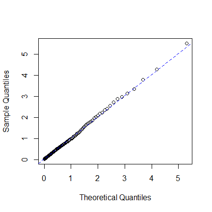

Example : emhawkes package
================
Kyungsub Lee
2025-08-26

## Basic Hawkes model

### Univariate Hawkes process

``` r
library(emhawkes)
```

This subsection outlines the steps for constructing, running
simulations, and estimating a univariate Hawkes model. To begin, create
an `hspec` object, which defines the Hawkes model. The S4 class `hspec`
contains slots for the model parameters: `mu`, `alpha`, `beta`,
`dimens`, `rmark`, and `impact`.

In a univariate model, the basic parameters of the model—`mu`, `alpha`,
and `beta`—can be given as numeric values. If numeric values are
provided, they will be converted to matrices. Below is an example of a
univariate Hawkes model without a mark.

``` r
mu1 <- 0.3; alpha1 <- 1.2; beta1 <- 1.5
hspec1 <- new("hspec", mu = mu1, alpha = alpha1, beta = beta1)
show(hspec1)
#> An object of class "hspec" of 1-dimensional Hawkes process
#> 
#> Slot mu: 
#>      [,1]
#> [1,]  0.3
#> 
#> Slot alpha: 
#>      [,1]
#> [1,]  1.2
#> 
#> Slot beta: 
#>      [,1]
#> [1,]  1.5
```

The function `hsim` implements simulation where the input arguments are
`hspec`, `size`, and the initial values of the intensity component
process, `lambda_component0`, and the initial values of the Hawkes
processes, `N0`. More precisely, the intensity process of the basic
univariate Hawkes model is represented by

$$
\lambda(t) = \mu + \int_{-\infty}^t \alpha e^{-\beta (t-s)} d N(s) = \mu + \lambda_c(0) e^{-\beta t} + \int_0^t \alpha e^{-\beta (t-s)} d N(s)
$$

where the `lambda_component0` denotes

$$
\lambda_c(0) = \int_{-\infty}^0 \alpha e^{\beta s} d N(s).
$$

If `lambda_component0` is not provided, the internally determined
initial values for the intensity process are used. If `size` is
sufficiently large, the exact value of `lambda_component0` may not be
important. The default initial value of the counting process, `N0`, is
zero.

``` r
set.seed(1107)
res1 <- hsim(hspec1, size = 1000)
summary(res1)
#> -------------------------------------------------------
#> Simulation result of exponential (marked) Hawkes model.
#> Realized path :
#>        arrival N1 mark lambda1
#>  [1,]  0.00000  0    0 0.90000
#>  [2,]  0.97794  1    1 0.43838
#>  [3,]  1.09001  2    1 1.43128
#>  [4,]  1.28999  3    1 2.02711
#>  [5,]  1.53225  4    1 2.33527
#>  [6,]  1.65001  5    1 3.01139
#>  [7,]  2.51807  6    1 1.36377
#>  [8,]  2.81710  7    1 1.74553
#>  [9,]  2.87547  8    1 2.72378
#> [10,]  3.16415  9    1 2.65016
#> [11,]  3.51378 10    1 2.40131
#> [12,]  4.22355 11    1 1.43843
#> [13,] 16.96752 12    1 0.30000
#> [14,] 17.71654 13    1 0.69015
#> [15,] 19.10293 14    1 0.49874
#> [16,] 24.06354 15    1 0.30082
#> [17,] 24.09256 16    1 1.44967
#> [18,] 28.40173 17    1 0.30366
#> [19,] 28.53743 18    1 1.28198
#> [20,] 28.56702 19    1 2.38725
#> ... with 980 more rows 
#> -------------------------------------------------------
```

The results of `hsim` is an S3 class `hreal`, which consists of `hspec`,
`inter_arrival`, `arrival`, `type`, `mark`, `N`, `Nc`, `lambda`,
`lambda_component`, `rambda`, `rambda_component`.

- `hspec` is the model specification.

- `inter_arrival` is the inter-arrival time of every event.

- `arrival` is the cumulative sum of `inter_arrival`.

- `type` is the type of events, i.e., $i$ for $N_i$, and is used for a
  multivariate model.

- `mark` is a numeric vector that represents additional information for
  the event.

- `lambda` represents $\lambda$, which is the left continuous and right
  limit version.

- The right continuous version of intensity is `rambda`.

- `lambda_component` represents $\lambda_{ij}$, and `rambda_component`
  is the right continuous version.

`inter_arrival`, `type`, `mark`, `N`, and `Nc` start at zero. Using the
`summary()` function, one can print the first 20 elements of `arrival`,
`N`, and `lambda`. The `print()` function can also be used.

By definition, we have `lambda == mu + lambda_component`.

``` r
# first and third columns are the same
cbind(res1$lambda[1:5], res1$lambda_component[1:5], mu1 + res1$lambda_component[1:5])
#>          [,1]     [,2]     [,3]
#> [1,] 0.900000 0.600000 0.900000
#> [2,] 0.438383 0.138383 0.438383
#> [3,] 1.431282 1.131282 1.431282
#> [4,] 2.027111 1.727111 2.027111
#> [5,] 2.335269 2.035269 2.335269
```

For all rows except the first, `rambda` equals `lambda + alpha` in this
model.

``` r
# second and third columns are the same
cbind(res1$lambda[1:5], res1$rambda[1:5], res1$lambda[1:5] + alpha1)
#>          [,1]     [,2]     [,3]
#> [1,] 0.900000 0.900000 2.100000
#> [2,] 0.438383 1.638383 1.638383
#> [3,] 1.431282 2.631282 2.631282
#> [4,] 2.027111 3.227111 3.227111
#> [5,] 2.335269 3.535269 3.535269
```

Additionally, verify that the exponential decay is accurately
represented in the model.

``` r
# By definition, the following two are equal:
res1$lambda[2:6]
#> [1] 0.438383 1.431282 2.027111 2.335269 3.011391
mu1 + (res1$rambda[1:5] - mu1) * exp(-beta1 * res1$inter_arrival[2:6])
#> [1] 0.438383 1.431282 2.027111 2.335269 3.011391
```

The log-likelihood function is calculated using the `logLik` method. In
this context, the inter-arrival times and `hspec` are provided as inputs
to the function.

``` r
logLik(hspec1, inter_arrival = res1$inter_arrival)
#> The initial values for intensity processes are not provided. Internally determined initial values are used.
#> loglikelihood 
#>     -214.2385
```

The likelihood estimation is performed using the `hfit` function. The
specification of the initial parameter values, `hspec0`, is required.
Note that only `inter_arrival` is needed for this univariate model. For
more accurate simulation, it is recommended to specify `lambda0`, the
initial value of the lambda component. If `lambda0` is not provided, the
function uses internally determined initial values. By default, the BFGS
method is employed for numerical optimization.

``` r
# initial value for numerical optimization
mu0 <- 0.5; alpha0 <- 1.0; beta0 <- 1.8
hspec0 <- new("hspec", mu = mu0, alpha = alpha0, beta = beta0)
# the intial values are provided through hspec
mle <- hfit(hspec0, inter_arrival = res1$inter_arrival)
summary(mle)
#> --------------------------------------------
#> Maximum Likelihood estimation
#> BFGS maximization, 24 iterations
#> Return code 0: successful convergence 
#> Log-Likelihood: -213.4658 
#> 3  free parameters
#> Estimates:
#>        Estimate Std. error t value Pr(> t)    
#> mu1     0.33641    0.03475   9.682  <2e-16 ***
#> alpha1  1.16654    0.09608  12.141  <2e-16 ***
#> beta1   1.52270    0.12468  12.213  <2e-16 ***
#> ---
#> Signif. codes:  0 '***' 0.001 '**' 0.01 '*' 0.05 '.' 0.1 ' ' 1
#> --------------------------------------------
```

### Bivariate Hawkes model

The intensity process of a basic bivariate Hawkes model is defined by

$$
 \lambda_1(t) = \mu_1 + \int_{-\infty}^t \alpha_{11} e^{-\beta_{11}(t-s)} d N_1(s) + \int_{-\infty}^t \alpha_{12} e^{-\beta_{12}(t-s)} d N_2(s),
$$

$$
 \lambda_2(t) = \mu_2 + \int_{-\infty}^t \alpha_{21} e^{-\beta_{21}(t-s)} d N_1(s) + \int_{-\infty}^t \alpha_{22} e^{-\beta_{22}(t-s)} d N_2(s).
$$

In a bivariate model, the parameters within the slots of `hspec` are
matrices. Specifically, `mu` is a 2-by-1 matrix, while `alpha` and
`beta` are 2-by-2 matrices.

$$
\mu = \begin{bmatrix} \mu_1 \\ \mu_2 \end{bmatrix}, \quad
\alpha = \begin{bmatrix} \alpha_{11} & \alpha_{12} \\ \alpha_{21} & \alpha_{22} \end{bmatrix}, \quad
\beta = 
\begin{bmatrix} \beta_{11} & \beta_{12} \\ \beta_{21} & \beta_{22} \end{bmatrix}
$$

`rmark` is a random number generating function for marks and is not used
in non-mark models. `lambda_component0` is a 2-by-2 matrix that
represents the initial values of `lambda_component`, which includes the
set of values `lambda11`, `lambda12`, `lambda21`, and `lambda22`. The
intensity processes are represented by

$$ \lambda_1(t) = \mu_1 + \lambda_{11}(t) + \lambda_{12}(t), $$

$$ \lambda_2(t) = \mu_2 + \lambda_{21}(t) + \lambda_{22}(t). $$

The terms $\lambda_{ij}$ are referred to as lambda components, and
`lambda0` represents \$\_{ij}(0)`.  The parameter`lambda_component0\`
can be omitted in this model, in which case internally determined
initial values will be used.

``` r
mu2 <- matrix(c(0.2), nrow = 2)
alpha2 <- matrix(c(0.5, 0.9, 0.9, 0.5), nrow = 2, byrow = TRUE)
beta2 <- matrix(c(2.25, 2.25, 2.25, 2.25), nrow = 2, byrow = TRUE)
hspec2 <- new("hspec", mu=mu2, alpha=alpha2, beta=beta2)
print(hspec2)
#> An object of class "hspec" of 2-dimensional Hawkes process
#> 
#> Slot mu: 
#>      [,1]
#> [1,]  0.2
#> [2,]  0.2
#> 
#> Slot alpha: 
#>      [,1] [,2]
#> [1,]  0.5  0.9
#> [2,]  0.9  0.5
#> 
#> Slot beta: 
#>      [,1] [,2]
#> [1,] 2.25 2.25
#> [2,] 2.25 2.25
```

To perform a simulation, use the `hsim` function.

``` r
set.seed(1107)
res2 <- hsim(hspec2,  size=1000)
summary(res2)
#> -------------------------------------------------------
#> Simulation result of exponential (marked) Hawkes model.
#> Realized path :
#>       arrival N1 N2 mark lambda1 lambda2
#>  [1,] 0.00000  0  0    0 0.52941 0.52941
#>  [2,] 0.57028  1  0    1 0.29130 0.29130
#>  [3,] 1.66175  1  1    1 0.25073 0.28505
#>  [4,] 2.17979  1  2    1 0.49638 0.38238
#>  [5,] 2.47685  1  3    1 0.81319 0.54975
#>  [6,] 2.64001  2  3    1 1.24825 0.78866
#>  [7,] 2.70249  3  3    1 1.54519 1.49341
#>  [8,] 2.94547  4  3    1 1.26810 1.46968
#>  [9,] 3.39313  4  4    1 0.77271 0.99242
#> [10,] 3.52533  4  5    1 1.29379 1.15989
#> [11,] 3.56971  5  5    1 2.00432 1.52115
#> [12,] 3.70761  5  6    1 1.88965 1.82866
#> [13,] 4.30122  5  7    1 0.88106 0.75983
#> [14,] 4.34337  6  7    1 1.63800 1.16393
#> [15,] 4.40222  7  7    1 1.89764 1.83275
#> [16,] 4.58943  8  7    1 1.64219 1.86211
#> [17,] 5.14665  9  7    1 0.75437 0.93131
#> [18,] 5.18186  9  8    1 1.17407 1.70707
#> [19,] 5.36167  9  9    1 1.45050 1.53925
#> [20,] 5.89118 10  9    1 0.85331 0.75875
#> ... with 980 more rows 
#> -------------------------------------------------------
```

In multivariate models, `type` is crucial as it represents the type of
event.

``` r
# Under bi-variate model, there are two types, 1 or 2.
res2$type[1:10]
#>  [1] 0 1 2 2 2 1 1 1 2 2
```

In multivariate models, the column names of `N` are `N1`, `N2`, `N3`,
and so on.

``` r
res2$N[1:3, ]
#>      N1 N2
#> [1,]  0  0
#> [2,]  1  0
#> [3,]  1  1
```

Similarly, the column names of `lambda` are `lambda1`, `lambda2`,
`lambda3`, and so on.

``` r
res2$lambda[1:3, ]
#>        lambda1   lambda2
#> [1,] 0.5294118 0.5294118
#> [2,] 0.2913028 0.2913028
#> [3,] 0.2507301 0.2850475
```

The column names of `lambda_component` are `lambda_component11`,
`lambda_component12`, `lambda_component13`, and so on.

``` r
res2$lambda_component[1:3, ]
#>        lambda11    lambda12   lambda21    lambda22
#> [1,] 0.11764706 0.211764706 0.21176471 0.117647059
#> [2,] 0.03260813 0.058694641 0.05869464 0.032608134
#> [3,] 0.04569443 0.005035631 0.08224997 0.002797573
```

By definition, the following two expressions are equivalent:

``` r
mu2[1] + rowSums(res2$lambda_component[1:5, c("lambda11", "lambda12")])
#> [1] 0.5294118 0.2913028 0.2507301 0.4963769 0.8131889
res2$lambda[1:5, "lambda1"]
#> [1] 0.5294118 0.2913028 0.2507301 0.4963769 0.8131889
```

From the results, we obtain vectors of realized `inter_arrival` and
`type`. A bivariate model requires both `inter_arrival` and `type` for
estimation.

``` r
inter_arrival2 <- res2$inter_arrival
type2 <- res2$type
```

The log-likelihood is computed using the `logLik` function.

``` r
logLik(hspec2, inter_arrival = inter_arrival2, type = type2)
#> The initial values for intensity processes are not provided. Internally determined initial values are used.
#> loglikelihood 
#>     -974.2809
```

Maximum log-likelihood estimation is performed using the `hfit`
function. In this process, the parameter values in `hspec0`, such as
`mu`, `alpha`, and `beta`, serve as starting points for the numerical
optimization. For illustration purposes, we set `hspec0 <- hspec2`.
Since the true parameter values are unknown in practical applications,
these initial guesses are used. The realized `inter_arrival` and `type`
data are utilized for estimation.

``` r
hspec0 <- hspec2
mle <- hfit(hspec0, inter_arrival = inter_arrival2, type = type2)
summary(mle)
#> --------------------------------------------
#> Maximum Likelihood estimation
#> BFGS maximization, 36 iterations
#> Return code 0: successful convergence 
#> Log-Likelihood: -970.1408 
#> 4  free parameters
#> Estimates:
#>          Estimate Std. error t value  Pr(> t)    
#> mu1       0.19095    0.01636  11.671  < 2e-16 ***
#> alpha1.1  0.48217    0.07405   6.511 7.45e-11 ***
#> alpha1.2  0.98625    0.09495  10.387  < 2e-16 ***
#> beta1.1   2.07987    0.16952  12.269  < 2e-16 ***
#> ---
#> Signif. codes:  0 '***' 0.001 '**' 0.01 '*' 0.05 '.' 0.1 ' ' 1
#> --------------------------------------------
```

``` r
coef(mle)
#>       mu1  alpha1.1  alpha1.2   beta1.1 
#> 0.1909541 0.4821725 0.9862542 2.0798691
```

``` r
miscTools::stdEr(mle)
#>        mu1   alpha1.1   alpha1.2    beta1.1 
#> 0.01636127 0.07405118 0.09495461 0.16952428
```

### Parameter setting

This subsection explores the relationship between parameter settings and
the estimation procedure in a multivariate Hawkes model. The number of
parameters to be estimated in the model is influenced by how we
configure parameter slots such as `mu`, `alpha`, and `beta` in `hspec0`,
which specifies the initial values.

Since the parameter slot `alpha` is a matrix, its elements can either be
the same or different. Consequently, the number of parameters estimated
varies depending on whether the initial settings have identical or
distinct elements.

For example, if `alpha[1,1]` and `alpha[1,2]` in `hspec0` are initially
set to different values, the numerical procedure will estimate
`alpha[1,1]` and `alpha[1,2]` separately. Conversely, if `alpha[1,1]`
and `alpha[1,2]` are the same in the initial setting, the estimation
procedure treats these parameters as identical in the model, thus
estimating only one value.

Recall that the example in the previous section features a symmetric
Hawkes model, where the matrix `alpha` is symmetric and all elements of
`beta` are identical.

``` r
print(hspec2)
#> An object of class "hspec" of 2-dimensional Hawkes process
#> 
#> Slot mu: 
#>      [,1]
#> [1,]  0.2
#> [2,]  0.2
#> 
#> Slot alpha: 
#>      [,1] [,2]
#> [1,]  0.5  0.9
#> [2,]  0.9  0.5
#> 
#> Slot beta: 
#>      [,1] [,2]
#> [1,] 2.25 2.25
#> [2,] 2.25 2.25
```

``` r
set.seed(1107)
res2 <- hsim(hspec2, size = 1000)
```

In the first estimation example, the initial value of `alpha0` is a
matrix where all elements are set to the same value of 0.75. In this
configuration, `hfit` assumes that `alpha11`, `alpha12`, `alpha21`, and
`alpha22` are identical in the model, even if the actual parameters have
different values. Similarly, the parameter matrices `mu0` and `beta0`
are treated in the same manner.

``` r
mu0 <- matrix(c(0.15, 0.15), nrow = 2)
alpha0 <- matrix(c(0.75, 0.75, 0.75, 0.75), nrow = 2, byrow=TRUE)
beta0 <- matrix(c(2.6, 2.6, 2.6, 2.6), nrow = 2, byrow=TRUE)

hspec0 <- new("hspec", mu=mu0, alpha=alpha0, beta=beta0)
summary(hfit(hspec0, inter_arrival = res2$inter_arrival, type = res2$type))
#> --------------------------------------------
#> Maximum Likelihood estimation
#> BFGS maximization, 44 iterations
#> Return code 0: successful convergence 
#> Log-Likelihood: -979.5687 
#> 3  free parameters
#> Estimates:
#>          Estimate Std. error t value Pr(> t)    
#> mu1       0.19125    0.01636   11.69  <2e-16 ***
#> alpha1.1  0.73981    0.05951   12.43  <2e-16 ***
#> beta1.1   2.09707    0.16524   12.69  <2e-16 ***
#> ---
#> Signif. codes:  0 '***' 0.001 '**' 0.01 '*' 0.05 '.' 0.1 ' ' 1
#> --------------------------------------------
```

Note that in the above result, `alpha1.1` falls somewhere between the
original values of `alpha1.1 = 0.5` and `alpha1.2 = 0.9`.

In the following second example, the elements of `alpha0` are not
identical but are symmetric, reflecting the original values used in the
simulation. Specifically, we have `alpha11 == alpha22` and
`alpha12 == alpha21` in `alpha0`, so `alpha11` and `alpha12` will be
estimated differently.

``` r
mu0 <- matrix(c(0.15, 0.15), nrow = 2)
alpha0 <- matrix(c(0.75, 0.751, 0.751, 0.75), nrow = 2, byrow=TRUE)
beta0 <- matrix(c(2.6, 2.6, 2.6, 2.6), nrow = 2, byrow=TRUE)

hspec0 <- new("hspec", mu=mu0, alpha=alpha0, beta=beta0)
summary(hfit(hspec0, inter_arrival = res2$inter_arrival, type = res2$type))
#> --------------------------------------------
#> Maximum Likelihood estimation
#> BFGS maximization, 30 iterations
#> Return code 0: successful convergence 
#> Log-Likelihood: -970.1408 
#> 4  free parameters
#> Estimates:
#>          Estimate Std. error t value Pr(> t)    
#> mu1       0.19095    0.01653  11.555 < 2e-16 ***
#> alpha1.1  0.48226    0.07572   6.369 1.9e-10 ***
#> alpha1.2  0.98626    0.09869   9.993 < 2e-16 ***
#> beta1.1   2.08008    0.18449  11.275 < 2e-16 ***
#> ---
#> Signif. codes:  0 '***' 0.001 '**' 0.01 '*' 0.05 '.' 0.1 ' ' 1
#> --------------------------------------------
```

In the third example, the estimation is performed under the assumption
that `mu1` and `mu2` may differ, even though they are the same in the
original model.

``` r
mu0 <- matrix(c(0.15, 0.14), nrow = 2)
alpha0 <- matrix(c(0.75, 0.751, 0.751, 0.75), nrow = 2, byrow=TRUE)
beta0 <- matrix(c(2.6, 2.6, 2.6, 2.6), nrow = 2, byrow=TRUE)

hspec0 <- new("hspec", mu=mu0, alpha=alpha0, beta=beta0)
summary(hfit(hspec0, inter_arrival = res2$inter_arrival, type = res2$type))
#> --------------------------------------------
#> Maximum Likelihood estimation
#> BFGS maximization, 42 iterations
#> Return code 0: successful convergence 
#> Log-Likelihood: -969.9914 
#> 5  free parameters
#> Estimates:
#>          Estimate Std. error t value  Pr(> t)    
#> mu1       0.18300    0.02154   8.495  < 2e-16 ***
#> mu2       0.19872    0.02203   9.020  < 2e-16 ***
#> alpha1.1  0.48149    0.07425   6.484 8.91e-11 ***
#> alpha1.2  0.98720    0.09556  10.331  < 2e-16 ***
#> beta1.1   2.07973    0.17094  12.166  < 2e-16 ***
#> ---
#> Signif. codes:  0 '***' 0.001 '**' 0.01 '*' 0.05 '.' 0.1 ' ' 1
#> --------------------------------------------
```

By setting `reduced = FALSE`, all parameters are estimated.

``` r
summary(hfit(hspec2, inter_arrival = res2$inter_arrival, type = res2$type, reduced=FALSE))
#> --------------------------------------------
#> Maximum Likelihood estimation
#> BFGS maximization, 51 iterations
#> Return code 0: successful convergence 
#> Log-Likelihood: -966.5055 
#> 10  free parameters
#> Estimates:
#>          Estimate Std. error t value  Pr(> t)    
#> mu1       0.17997    0.02312   7.784 7.05e-15 ***
#> mu2       0.20060    0.02442   8.214  < 2e-16 ***
#> alpha1.1  0.44726    0.16627   2.690  0.00714 ** 
#> alpha2.1  1.17743    0.22909   5.140 2.75e-07 ***
#> alpha1.2  0.97048    0.14242   6.814 9.47e-12 ***
#> alpha2.2  0.48979    0.15398   3.181  0.00147 ** 
#> beta1.1   2.52210    1.16375   2.167  0.03022 *  
#> beta2.1   3.15498    0.67702   4.660 3.16e-06 ***
#> beta1.2   1.80167    0.25695   7.012 2.35e-12 ***
#> beta2.2   1.51338    0.54476   2.778  0.00547 ** 
#> ---
#> Signif. codes:  0 '***' 0.001 '**' 0.01 '*' 0.05 '.' 0.1 ' ' 1
#> --------------------------------------------
```

The same logic applies to all higher-dimensional models.

### Residual process

The residual process can be extracted using the `logLik()` function by
setting `infer = TRUE`. When this option is enabled, the `logLik`
function returns a list that includes the log-likelihood, inferred
intensities, and the residual process. Note that the inference is based
on the object passed to the `logLik` function. In the returned object,
`res_process1` represents the residual process.

``` r
hrp <- new("hspec", mu = 0.3, alpha = 1.2, beta = 1.5)
res_rp <- hsim(hrp, size = 1000)

# inferred result
infered_res <- logLik(hrp, res_rp$inter_arrival, infer = TRUE)

## QQ-plot
p <- ppoints(100)
q <- quantile(infered_res$res_process1, p = p)
plot(qexp(p), q, xlab="Theoretical Quantiles",ylab="Sample Quantiles")
qqline(q, distribution=qexp,col="blue", lty=2)
```

<!-- -->

In practical scenarios, the parameter values are usually unknown, so the
model may be estimated before computing the residual processes.

``` r

# estimation
mle_rp <- hfit(new("hspec", mu = 0.2, alpha = 1, beta = 2),
               res_rp$inter_arrival)

# construct hspec from estimation result
he <- new("hspec", mu = coef(mle_rp)["mu1"], 
          alpha = coef(mle_rp)["alpha1"], beta = coef(mle_rp)["beta1"])

# infer intensity
infered_res <- logLik(he, res_rp$inter_arrival, res_rp$type, infer = TRUE)

rpe <- infered_res$res_process1

p <- ppoints(100)
q <- quantile(rpe, p=p)
plot(qexp(p), q, xlab="Theoretical Quantiles",ylab="Sample Quantiles")
qqline(q, distribution=qexp,col="blue", lty=2)
```

<!-- -->

In an $n$-dimensional model, we can compute the residuals in a similar
manner. In this case, the object returned by the `logLik` function
contains $n$ residual processes. For example, in the following code,
`infer_res2$res_process1` and `infer_res2$res_process2` represent the
residual processes for each type.

``` r
hrp2 <- new("hspec", mu = rep(0.3, 2), 
           alpha = matrix(c(1.2, 1.5, 1.5, 1.2), nrow=2), 
           beta = matrix(rep(3, 4), nrow=2))
res_hrp2 <- hsim(hrp2, size = 2000)

infer_res2 <- logLik(hrp2, res_hrp2$inter_arrival, res_hrp2$type, infer = TRUE)

p <- ppoints(100)
q <- quantile(c(infer_res2$res_process1, infer_res2$res_process2), p=p)
plot(qexp(p), q, xlab="Theoretical Quantiles",ylab="Sample Quantiles")
qqline(q, distribution=qexp,col="blue", lty=2)
```

<!-- -->

``` r
# Infer the residual process using the log-likelihood method
# 'infer_res_dh1' contains the inferred process data based on the inter-arrival times

hist(
  c(infer_res2$res_process1, infer_res2$res_process2),
  breaks = 50,
  probability = TRUE,
  main = "Histogram of Inferred Residual Process",
  xlab = "Residual Value",
  ylab = "Density"
)

x <- seq(0, 8, 0.1)

lines(
  x,
  dexp(x),
  col = 'red',
  lwd = 2
)

legend("topright", legend = "Theoretical PDF", col = "red", lwd = 2)
```

<!-- -->

## More complicated model

### Multi-kernel model

In a multi-kernel Hawkes model, `type_col_map` is required for `hspec`.
`type_col_map` is a list that represents the mapping between type and
column number. For example, consider a bi-variate multi-kernel model: $$
\lambda_t = \mu + \int_{-\infty}^{t} h(t-u) d N(u)
$$ where $$ h = \sum_{k=1}^{K} h_k, \quad 
h_k (t) = \alpha_k \circ \begin{bmatrix}
e^{-\beta_{k11} t} & e^{-\beta_{k12} t} \\
e^{-\beta_{k21} t} & e^{-\beta_{k22} t}
\end{bmatrix}
 $$

with matrix $\alpha_k$ and $k$ denoting kernel number.

For example, in a bi-variate Hawkes model with two kernels, the
intensity processes are

$$
 \begin{bmatrix} \lambda_1(t) \\ \lambda_2(t) \end{bmatrix} = 
\begin{bmatrix} \mu_1 \\ \mu_2 \end{bmatrix} + \int_{-\infty}^{t} \begin{bmatrix}
\alpha_{111} e^{-\beta_{111} t} & \alpha_{112} e^{-\beta_{112} t} \\
\alpha_{121}e^{-\beta_{121} t} & \alpha_{122}e^{-\beta_{122} t}
\end{bmatrix} \begin{bmatrix} d N_1(s) \\ dN_2(s) \end{bmatrix} 
+ \int_{-\infty}^{t} \begin{bmatrix}
\alpha_{211} e^{-\beta_{211} t} & \alpha_{212} e^{-\beta_{212} t} \\
\alpha_{221}e^{-\beta_{221} t} & \alpha_{222}e^{-\beta_{222} t}
\end{bmatrix} \begin{bmatrix} d N_1(s) \\ dN_2(s) \end{bmatrix}.
$$

The parameter matrix is defined by

$$
 \alpha = \begin{bmatrix} \alpha_{111} & \alpha_{112} & \alpha_{211} & \alpha_{212} \\ \alpha_{121} & \alpha_{122} & \alpha_{221} & \alpha_{222}
\end{bmatrix}, \quad
 \beta = \begin{bmatrix} \beta_{111} & \beta_{112} & \beta_{211} & \beta_{212} \\ \beta_{121} & \beta_{122} & \beta_{221} & \beta_{222}
\end{bmatrix} \quad
$$

and we should specify which columns of matrix are associated with which
$N_i$.

``` r
mu <- matrix(c(0.02, 0.02), nrow=2)
      
beta_1 <- matrix(rep(10, 4), nrow=2) 
beta_2 <- matrix(rep(1, 4), nrow=2)
beta  <- cbind(beta_1, beta_2)
      
alpha_1 <- matrix(c(3, 2,
                    2, 3), nrow=2, byrow=TRUE)
alpha_2 <- matrix(c(0.3, 0.2,
                    0.2, 0.3), nrow=2, byrow=TRUE)
alpha <- cbind(alpha_1, alpha_2)

print(alpha)
#>      [,1] [,2] [,3] [,4]
#> [1,]    3    2  0.3  0.2
#> [2,]    2    3  0.2  0.3
```

Note that $d N_1(s)$ is multiplied by first and third columns of
$\alpha$ and $dN_2(s)$ is multiplied by second and fourth columns of
$\alpha$ and hence `type_col_map` is

``` r
type_col_map <- list(c(1,3),  # columns for dN1
                     c(2,4))  # columns for dN2
type_col_map
#> [[1]]
#> [1] 1 3
#> 
#> [[2]]
#> [1] 2 4
```

where type `i` is associated with columns of `type_col_map[[i]]`. Thus,

``` r
cat("Part of alpha associated with N1: \n")
#> Part of alpha associated with N1:
alpha[, type_col_map[[1]]]  # associated with N1
#>      [,1] [,2]
#> [1,]    3  0.3
#> [2,]    2  0.2
cat("Part of alpha associated with N2: \n")
#> Part of alpha associated with N2:
alpha[, type_col_map[[2]]]  # associated with N2
#>      [,1] [,2]
#> [1,]    2  0.2
#> [2,]    3  0.3

cat("Part of beta associated with N1: \n")
#> Part of beta associated with N1:
beta[, type_col_map[[1]]]  # associated with N1
#>      [,1] [,2]
#> [1,]   10    1
#> [2,]   10    1
cat("Part of beta associated with N2: \n")
#> Part of beta associated with N2:
beta[, type_col_map[[2]]]  # associated with N2
#>      [,1] [,2]
#> [1,]   10    1
#> [2,]   10    1
```

``` r
h <- new("hspec", mu = mu, alpha = alpha, beta=beta, type_col_map = type_col_map)
h
#> An object of class "hspec" of 2-dimensional Hawkes process
#> 
#> Slot mu: 
#>      [,1]
#> [1,] 0.02
#> [2,] 0.02
#> 
#> Slot alpha: 
#>      [,1] [,2] [,3] [,4]
#> [1,]    3    2  0.3  0.2
#> [2,]    2    3  0.2  0.3
#> 
#> Slot beta: 
#>      [,1] [,2] [,3] [,4]
#> [1,]   10   10    1    1
#> [2,]   10   10    1    1
#> 
#> Slot type_col_map: 
#> [[1]]
#> [1] 1 3
#> 
#> [[2]]
#> [1] 2 4
```

In addition, `lambda_component0` should be provided for simulation and
estimation.

``` r
set.seed(620)
res_mk <- hsim(h, size = 3000, 
               # for an illustration purpose
               lambda_component0 = matrix(seq(1, 1.7, 0.1), nrow = 2)) 
res_mk
#> -------------------------------------------------------
#> Simulation result of exponential (marked) Hawkes model.
#> An object of class "hspec" of 2-dimensional Hawkes process
#> 
#> Slot mu: 
#>      [,1]
#> [1,] 0.02
#> [2,] 0.02
#> 
#> Slot alpha: 
#>      [,1] [,2] [,3] [,4]
#> [1,]    3    2  0.3  0.2
#> [2,]    2    3  0.2  0.3
#> 
#> Slot beta: 
#>      [,1] [,2] [,3] [,4]
#> [1,]   10   10    1    1
#> [2,]   10   10    1    1
#> 
#> Slot type_col_map: 
#> [[1]]
#> [1] 1 3
#> 
#> [[2]]
#> [1] 2 4
#> 
#> 
#> Realized path :
#>       arrival N1 N2 mark lambda1 lambda2  lambda11  lambda12 lambda13 lambda14
#>  [1,]  0.0000  0  0    0   5.220   5.620 1.0000000 1.200e+00   1.4000   1.6000
#>  [2,]  0.3339  1  0    1   2.247   2.397 0.0354893 4.259e-02   1.0026   1.1459
#>  [3,]  1.2043  1  1    1   1.046   1.064 0.0005036 7.065e-06   0.5455   0.4799
#>  [4,]  1.2103  2  1    1   3.122   4.182 0.0004743 1.884e+00   0.5423   0.6758
#>  [5,]  1.3704  3  1    1   2.299   2.302 0.6051446 3.799e-01   0.7176   0.5758
#>  [6,]  1.4098  3  2    1   4.238   3.474 2.4298143 2.561e-01   0.9783   0.5535
#>  [7,]  1.5416  3  3    1   2.793   2.894 0.6507825 6.043e-01   0.8575   0.6605
#>  [8,]  1.6639  3  4    1   2.498   2.919 0.1914158 7.660e-01   0.7588   0.7614
#>  [9,]  2.0338  3  5    1   1.282   1.454 0.0047375 6.846e-02   0.5242   0.6642
#> [10,]  2.1098  4  5    1   2.276   2.981 0.0022151 9.671e-01   0.4858   0.8009
#> [11,]  2.3626  5  5    1   1.569   1.623 0.2396920 7.722e-02   0.6103   0.6220
#> [12,]  2.7052  5  6    1   1.216   1.178 0.1053725 2.511e-03   0.6462   0.4416
#> [13,]  2.7692  5  7    1   2.339   2.939 0.0555568 1.056e+00   0.6062   0.6018
#> [14,]  2.9333  6  7    1   1.818   2.272 0.0107638 5.920e-01   0.5144   0.6804
#> [15,]  3.0063  7  7    1   3.146   2.862 1.4508962 2.853e-01   0.7571   0.6325
#> [16,]  3.3222  7  8    1   1.453   1.365 0.1889842 1.211e-02   0.7707   0.4612
#> [17,]  3.3779  7  9    1   2.636   3.241 0.1082998 1.153e+00   0.7290   0.6254
#> [18,]  3.4084  8  9    1   3.931   5.226 0.0798097 2.324e+00   0.7071   0.8006
#> [19,]  3.7871  8 10    1   1.380   1.425 0.0698539 5.270e-02   0.6897   0.5482
#> [20,]  3.8329  9 10    1   2.736   3.505 0.0441702 1.298e+00   0.6588   0.7147
#>        lambda21  lambda22 lambda23 lambda24
#>  [1,] 1.1000000 1.300e+00   1.5000   1.7000
#>  [2,] 0.0390382 4.614e-02   1.0742   1.2175
#>  [3,] 0.0003383 7.654e-06   0.5336   0.5098
#>  [4,] 0.0003186 2.826e+00   0.5304   0.8050
#>  [5,] 0.4034302 5.699e-01   0.6224   0.6859
#>  [6,] 1.6198765 3.841e-01   0.7906   0.6594
#>  [7,] 0.4338551 9.064e-01   0.6930   0.8410
#>  [8,] 0.1276106 1.149e+00   0.6132   1.0095
#>  [9,] 0.0031583 1.027e-01   0.4236   0.9046
#> [10,] 0.0014767 1.451e+00   0.3926   1.1165
#> [11,] 0.1597947 1.158e-01   0.4602   0.8671
#> [12,] 0.0702484 3.767e-03   0.4687   0.6156
#> [13,] 0.0370378 1.584e+00   0.4397   0.8588
#> [14,] 0.0071759 8.881e-01   0.3731   0.9834
#> [15,] 0.9672641 4.280e-01   0.5328   0.9142
#> [16,] 0.1259895 1.817e-02   0.5343   0.6665
#> [17,] 0.0721999 1.730e+00   0.5053   0.9142
#> [18,] 0.0532064 3.485e+00   0.4901   1.1777
#> [19,] 0.0465693 7.905e-02   0.4726   0.8065
#> [20,] 0.0294468 1.947e+00   0.4514   1.0569
#> ... with 2980 more rows 
#> -------------------------------------------------------
```

``` r
summary(hfit(h, res_mk$inter_arrival, res_mk$type,
             lambda_component0 = matrix(seq(1, 1.7, 0.1), nrow = 2)))
#> --------------------------------------------
#> Maximum Likelihood estimation
#> BFGS maximization, 77 iterations
#> Return code 0: successful convergence 
#> Log-Likelihood: 6084.72 
#> 7  free parameters
#> Estimates:
#>          Estimate Std. error t value  Pr(> t)    
#> mu1      0.011160   0.007537   1.481    0.139    
#> alpha1.1 2.474055   0.206092  12.005  < 2e-16 ***
#> alpha1.2 1.380731   0.220328   6.267 3.69e-10 ***
#> alpha1.3 0.044029   0.071762   0.614    0.540    
#> alpha1.4 0.231188   0.058453   3.955 7.65e-05 ***
#> beta1.1  6.202489   0.077197  80.346  < 2e-16 ***
#> beta1.3  0.700718   0.117474   5.965 2.45e-09 ***
#> ---
#> Signif. codes:  0 '***' 0.001 '**' 0.01 '*' 0.05 '.' 0.1 ' ' 1
#> --------------------------------------------
```

### Synchronized intensity model

This model is basically two-kernel model and defined by little bit
complicated reparameterization.

$$
 \mu = \begin{bmatrix} \theta/(1 - \kappa)/2 + \tilde\theta/(1 + \kappa)/2 \\
\theta/(1 - \kappa)/2 - \tilde\theta/(1 + \kappa)/2 \end{bmatrix}, \quad \theta = (\theta^- + \theta^+)/2,\quad \tilde\theta=(\theta^- -\theta^+)/2
$$

$$
\alpha = \begin{bmatrix} \zeta & \tilde\zeta & \zeta & -\tilde\zeta \\
\zeta & -\tilde\zeta & \zeta & \tilde\zeta
\end{bmatrix}, \quad \zeta = (\eta + \nu) / 2, \quad \tilde \zeta = (\eta - \nu)/ 2 
$$

$$
\beta = \begin{bmatrix} \beta_1 & \beta_2 & \beta_1 & \beta_2 \\
\beta_1 & \beta_2 & \beta_1 & \beta_2 \end{bmatrix}, \quad \beta_1 = (\eta + \nu) / 2, \quad \beta_2 = (\eta - \nu)/2
$$

In order to handle complex re-parametrization, each slot is expressed as
a function rather than a matrix. The first argument `param` is a set of
parameters.

``` r
mu <- function(param = c(theta_p = 0.15, theta_n = 0.21, kappa = 0.12)){
  theta    <- (param["theta_n"] + param["theta_p"])/2
  theta_tl <- (param["theta_n"] - param["theta_p"])/2
  matrix(c(theta/2/(1 - param["kappa"]) + theta_tl/2/(1 + param["kappa"]),
           theta/2/(1 - param["kappa"]) - theta_tl/2/(1 + param["kappa"])), nrow=2)
}

alpha <- function(param = c(eta = 5, nu = 3)){
  zeta    <- (param["eta"] + param["nu"])/2
  zeta_tl <- (param["eta"] - param["nu"])/2
  matrix(c(zeta, zeta_tl, zeta, -zeta_tl,
           zeta, -zeta_tl, zeta, zeta_tl), nrow=2, byrow=TRUE)
}

beta <- function(param = c(beta = 12, kappa = 0.12)){
  beta1 <- param["beta"] * (1 - param["kappa"])
  beta2 <- param["beta"] * (1 + param["kappa"])
  matrix(c(beta1, beta2, beta1, beta2,
           beta1, beta2, beta1, beta2), nrow = 2, byrow = TRUE)
}

type_col_map <- list(c(1,2), c(3,4))

h_sy <- new("hspec", mu = mu, alpha = alpha, beta = beta, type_col_map = type_col_map)
h_sy
#> An object of class "hspec" of 2-dimensional Hawkes process
#> 
#> Slot mu: 
#> function (param = c(theta_p = 0.15, theta_n = 0.21, kappa = 0.12)) 
#> {
#>     theta <- (param["theta_n"] + param["theta_p"])/2
#>     theta_tl <- (param["theta_n"] - param["theta_p"])/2
#>     matrix(c(theta/2/(1 - param["kappa"]) + theta_tl/2/(1 + param["kappa"]), 
#>         theta/2/(1 - param["kappa"]) - theta_tl/2/(1 + param["kappa"])), 
#>         nrow = 2)
#> }
#> <bytecode: 0x00000225aa03ceb0>
#> 
#> Slot alpha: 
#> function (param = c(eta = 5, nu = 3)) 
#> {
#>     zeta <- (param["eta"] + param["nu"])/2
#>     zeta_tl <- (param["eta"] - param["nu"])/2
#>     matrix(c(zeta, zeta_tl, zeta, -zeta_tl, zeta, -zeta_tl, zeta, 
#>         zeta_tl), nrow = 2, byrow = TRUE)
#> }
#> <bytecode: 0x00000225a944ec40>
#> 
#> Slot beta: 
#> function (param = c(beta = 12, kappa = 0.12)) 
#> {
#>     beta1 <- param["beta"] * (1 - param["kappa"])
#>     beta2 <- param["beta"] * (1 + param["kappa"])
#>     matrix(c(beta1, beta2, beta1, beta2, beta1, beta2, beta1, 
#>         beta2), nrow = 2, byrow = TRUE)
#> }
#> <bytecode: 0x00000225a6f97ee0>
#> 
#> Slot type_col_map: 
#> [[1]]
#> [1] 1 2
#> 
#> [[2]]
#> [1] 3 4
```

``` r
set.seed(1107)
# run simulation
res_sy <- hsim(h_sy, size = 2000, lambda_component0 = matrix(rep(1, 2 * 4), nrow=2))
summary(res_sy)
#> -------------------------------------------------------
#> Simulation result of exponential (marked) Hawkes model.
#> Realized path :
#>       arrival N1 N2 mark lambda1 lambda2
#>  [1,]  0.0000  0  0    0 4.11567 4.08888
#>  [2,]  7.2506  0  1    1 0.11567 0.08888
#>  [3,]  7.4805  0  2    1 0.42304 0.48724
#>  [4,]  7.4915  1  2    1 3.09049 4.86829
#>  [5,] 17.7981  2  2    1 0.11567 0.08888
#>  [6,] 20.0276  2  3    1 0.11567 0.08888
#>  [7,] 20.0484  2  4    1 2.56966 4.05419
#>  [8,] 20.0609  3  4    1 4.94847 7.88899
#>  [9,] 20.1607  4  4    1 3.58697 3.81330
#> [10,] 20.2304  5  4    1 4.09539 3.38445
#> [11,] 20.5057  5  5    1 0.56602 0.47289
#> [12,] 26.4862  6  5    1 0.11567 0.08888
#> [13,] 32.5114  6  6    1 0.11567 0.08888
#> [14,] 32.6227  6  7    1 1.12663 1.54804
#> [15,] 32.6316  6  8    1 3.79509 5.94053
#> [16,] 32.6480  7  8    1 5.81283 9.13210
#> [17,] 32.6921  7  9    1 6.87877 7.59586
#> [18,] 32.7953  8  9    1 3.51752 4.17621
#> [19,] 32.9249  8 10    1 2.20298 1.94570
#> [20,] 34.7648  9 10    1 0.11567 0.08888
#> ... with 1980 more rows 
#> -------------------------------------------------------
```

The estimation is based on function arguments `param`. In addition, the
initial values of the numerical optimization is the default values
specified in `param`. Note that the same name arguments are treated as
the same parameter. `kappa` is in both of `mu` and `beta`, but only one
`kappa` appears in the estimation result.

``` r
fit_sy <- hfit(h_sy, inter_arrival=res_sy$inter_arrival, 
               type=res_sy$type,
               lambda_component0 = matrix(rep(1, 2 * 4), nrow=2))
summary(fit_sy)
#> --------------------------------------------
#> Maximum Likelihood estimation
#> BFGS maximization, 77 iterations
#> Return code 0: successful convergence 
#> Log-Likelihood: -260.6273 
#> 6  free parameters
#> Estimates:
#>         Estimate Std. error t value  Pr(> t)    
#> theta_p  0.08291    0.01587   5.223 1.76e-07 ***
#> theta_n  0.16264    0.01695   9.594  < 2e-16 ***
#> kappa    0.40990    0.02294  17.866  < 2e-16 ***
#> eta      5.23253    0.36946  14.163  < 2e-16 ***
#> nu       2.89429    0.32969   8.779  < 2e-16 ***
#> beta    18.01820        NaN     NaN      NaN    
#> ---
#> Signif. codes:  0 '***' 0.001 '**' 0.01 '*' 0.05 '.' 0.1 ' ' 1
#> --------------------------------------------
```

## Extended model

The following family of extended multi-variate marked Hawkes models are
implemented:

$$
 \lambda(t) = \mu + \int_{(-\infty,t)\times E} h(t, u, z)M(du \times dz)
$$

where the kernel $h$ is represented by

$$
h(t, u, z) = (\alpha + g(t, z))\Gamma(t),
$$

and

- $\alpha$ is a constant matrix,

- $g(t, z)$ is additional impacts on intensities, which may depend on
  mark, or any information generated by underlying processes,

- $\Gamma(t)$ is exponential decaying matrix such that
  $\Gamma_{ij}(t) = e^{-\beta_{ij}(t)}$,

- $M$ denotes the random measures defined on the product of time and
  mark spaces.

### Linear impact model

In the linear impact model,

$$
 g(t, z) = \eta (z-1).
$$

`impact` represents $\Psi(z)$, the impact of mark on future intensity.
For details, see [Marked Hawkes process modeling of price dynamics and
volatility
estimation](https://www.sciencedirect.com/science/article/abs/pii/S0927539816300810).

It is a function, and the first argument is `param` represents the
parameter of the model. `impact()` function can have additional
arguments related to the model specification or generated path, such as
`n`, `mark`, etc. Do not miss `...` as the ellipsis is omitted, an error
occurs. `rmark()` is a function that generate marks for simulation.

``` r
mu <- matrix(c(0.15, 0.15), nrow=2)
alpha <- matrix(c(0.75, 0.6, 0.6, 0.75), nrow=2, byrow=T)
beta <- matrix(c(2.6, 2.6, 2.6, 2.6), nrow=2)
rmark <- function(param = c(p=0.65), ...){
  rgeom(1, p=param[1]) + 1
}

impact <- function(param = c(eta1=0.2), alpha, n, mark, ...){
  ma <- matrix(rep(mark[n]-1, 4), nrow = 2)
  ma * matrix( rep(param["eta1"], 4), nrow=2)
}

hi <- new("hspec", mu=mu, alpha=alpha, beta=beta,
          rmark = rmark,
          impact=impact)
hi
#> An object of class "hspec" of 2-dimensional Hawkes process
#> 
#> Slot mu: 
#>      [,1]
#> [1,] 0.15
#> [2,] 0.15
#> 
#> Slot alpha: 
#>      [,1] [,2]
#> [1,] 0.75 0.60
#> [2,] 0.60 0.75
#> 
#> Slot beta: 
#>      [,1] [,2]
#> [1,]  2.6  2.6
#> [2,]  2.6  2.6
#> 
#> Slot impact: 
#> function (param = c(eta1 = 0.2), alpha, n, mark, ...) 
#> {
#>     ma <- matrix(rep(mark[n] - 1, 4), nrow = 2)
#>     ma * matrix(rep(param["eta1"], 4), nrow = 2)
#> }
#> 
#> Slot rmark: 
#> function (param = c(p = 0.65), ...) 
#> {
#>     rgeom(1, p = param[1]) + 1
#> }
```

``` r
set.seed(1107)
res_impact <- hsim(hi, size=1000, lambda_component0 = matrix(rep(0.1,4), nrow=2))
summary(res_impact)
#> -------------------------------------------------------
#> Simulation result of exponential (marked) Hawkes model.
#> Realized path :
#>       arrival N1 N2 mark lambda1 lambda2
#>  [1,]  0.0000  0  0    0 0.35000 0.35000
#>  [2,]  1.3001  0  1    1 0.15681 0.15681
#>  [3,]  2.5585  1  1    2 0.17302 0.17871
#>  [4,]  2.7982  1  2    1 0.67171 0.59433
#>  [5,]  3.0525  2  2    2 0.72904 0.76653
#>  [6,]  3.3929  3  2    1 0.78108 0.73464
#>  [7,]  3.4509  4  2    3 1.33764 1.16872
#>  [8,]  3.5101  5  2    2 2.15429 1.88085
#>  [9,]  3.5837  6  2    1 2.58987 2.24016
#> [10,]  3.6041  7  2    1 3.17455 2.70074
#> [11,]  3.7053  8  2    1 3.05159 2.57205
#> [12,]  3.9277  9  2    1 2.19788 1.84482
#> [13,]  3.9610 10  2    1 2.71584 2.25450
#> [14,]  4.2448 11  2    1 1.73576 1.44339
#> [15,]  4.7277 12  2    4 0.81551 0.68947
#> [16,]  5.1473 12  3    1 0.82698 0.73426
#> [17,]  5.3229 12  4    2 0.95877 0.99505
#> [18,]  5.4219 13  4    1 1.39371 1.53772
#> [19,]  5.4869 14  4    2 1.83388 1.82882
#> [20,]  5.8857 14  5    1 1.08385 1.02887
#> ... with 980 more rows 
#> -------------------------------------------------------
```

``` r
fit <- hfit(hi, 
            inter_arrival = res_impact$inter_arrival,
            type = res_impact$type,
            mark = res_impact$mark,
            lambda_component0 = matrix(rep(0.1,4), nrow=2))

summary(fit)
#> --------------------------------------------
#> Maximum Likelihood estimation
#> BFGS maximization, 38 iterations
#> Return code 0: successful convergence 
#> Log-Likelihood: -1525.501 
#> 5  free parameters
#> Estimates:
#>          Estimate Std. error t value Pr(> t)    
#> mu1       0.13190    0.00891  14.804  <2e-16 ***
#> alpha1.1  0.67609    0.07742   8.732  <2e-16 ***
#> alpha1.2  0.60345    0.07211   8.368  <2e-16 ***
#> beta1.1   2.22126    0.16730  13.277  <2e-16 ***
#> eta1      0.11635    0.05549   2.097   0.036 *  
#> ---
#> Signif. codes:  0 '***' 0.001 '**' 0.01 '*' 0.05 '.' 0.1 ' ' 1
#> --------------------------------------------
```

For a special case of linear impact function, the following
implementation is recommended. In a marked Hawkes model, the additional
linear impact can be represented by slot `eta`. In this model, the
intensity process is

$$
 \lambda(t) = \mu + \int_{(-\infty, t)\times E} (\alpha + \eta (z-1)) e^{-\beta(t-u)}  M(dt \times dz).
$$

``` r

rmark <- function(param = c(p=0.65), ...){
  rgeom(1, p=param[1]) + 1
}

h <-  new("hspec", mu=0.15, alpha=0.7, beta=1.6, eta=0.3,
          rmark = rmark)
h
#> An object of class "hspec" of 1-dimensional Hawkes process
#> 
#> Slot mu: 
#>      [,1]
#> [1,] 0.15
#> 
#> Slot alpha: 
#>      [,1]
#> [1,]  0.7
#> 
#> Slot beta: 
#>      [,1]
#> [1,]  1.6
#> 
#> Slot eta: 
#>      [,1]
#> [1,]  0.3
#> 
#> Slot rmark: 
#> function (param = c(p = 0.65), ...) 
#> {
#>     rgeom(1, p = param[1]) + 1
#> }
```

``` r
set.seed(1107)
res <- hsim(h, size = 1000)
summary(res)
#> -------------------------------------------------------
#> Simulation result of exponential (marked) Hawkes model.
#> Realized path :
#>       arrival N1 mark lambda1
#>  [1,]  0.0000  0    0 0.20833
#>  [2,]  1.9559  1    1 0.15255
#>  [3,]  3.2143  2    1 0.24381
#>  [4,]  3.9750  3    1 0.38501
#>  [5,]  4.5731  4    1 0.50912
#>  [6,]  7.7740  5    1 0.15632
#>  [7,] 11.9290  6    2 0.15092
#>  [8,] 13.4270  7    1 0.24108
#>  [9,] 23.3482  8    1 0.15000
#> [10,] 31.9666  9    3 0.15000
#> [11,] 32.0257 10    2 1.33257
#> [12,] 32.1598 11    1 1.91124
#> [13,] 36.9851 12    1 0.15109
#> [14,] 37.1167 13    2 0.71795
#> [15,] 38.4261 14    1 0.34298
#> [16,] 38.9803 15    1 0.51792
#> [17,] 42.9827 16    2 0.15177
#> [18,] 48.4580 17    1 0.15016
#> [19,] 48.7737 18    1 0.57247
#> [20,] 48.7910 19    2 1.24194
#> ... with 980 more rows 
#> -------------------------------------------------------
```

``` r
fit <- hfit(h, 
            inter_arrival = res$inter_arrival,
            type = res$type,
            mark = res$mark)
summary(fit)
#> --------------------------------------------
#> Maximum Likelihood estimation
#> BFGS maximization, 37 iterations
#> Return code 0: successful convergence 
#> Log-Likelihood: -1684.238 
#> 4  free parameters
#> Estimates:
#>        Estimate Std. error t value  Pr(> t)    
#> mu1     0.14557    0.00847  17.187  < 2e-16 ***
#> alpha1  0.63917    0.06892   9.275  < 2e-16 ***
#> beta1   1.48983    0.12320  12.092  < 2e-16 ***
#> eta1    0.33626    0.07723   4.354 1.34e-05 ***
#> ---
#> Signif. codes:  0 '***' 0.001 '**' 0.01 '*' 0.05 '.' 0.1 ' ' 1
#> --------------------------------------------
```

If you want to estimate the mark distribution also, then `dmark` slot
that describes the density function of mark is required.

``` r
h_md <- h

h_md@dmark <- function(param = c(p = 0.1), n=n, mark=mark, ...){
   dgeom(mark[n] - 1, prob = param["p"])
}

mle_md <- hfit(h_md, 
               inter_arrival = res$inter_arrival, type = res$type, mark = res$mark)
summary(mle_md)
#> --------------------------------------------
#> Maximum Likelihood estimation
#> BFGS maximization, 46 iterations
#> Return code 0: successful convergence 
#> Log-Likelihood: -2657.079 
#> 5  free parameters
#> Estimates:
#>        Estimate Std. error t value  Pr(> t)    
#> mu1    0.145574   0.008468  17.190  < 2e-16 ***
#> alpha1 0.639168   0.069753   9.163  < 2e-16 ***
#> beta1  1.489843   0.124301  11.986  < 2e-16 ***
#> eta1   0.336259   0.076904   4.372 1.23e-05 ***
#> p      0.658970   0.012203  54.002  < 2e-16 ***
#> ---
#> Signif. codes:  0 '***' 0.001 '**' 0.01 '*' 0.05 '.' 0.1 ' ' 1
#> --------------------------------------------
```

### Hawkes flocking model

The function $g$ is not necessarily depend on mark. In the Hawkes
flocking model, the kernel component is represented by $$
\alpha = \begin{bmatrix}\alpha_{11} & \alpha_{12} & 0 & 0 \\\alpha_{12}& \alpha_{11} & 0 & 0 \\0 & 0 & \alpha_{33} & \alpha_{34} \\0 & 0 & \alpha_{34} & \alpha_{33} \end{bmatrix},
$$ $$ 
g = \begin{bmatrix} 0 & 0 & \alpha_{1w} 1_{\{C_1(t) < C_2(t)\}} & \alpha_{1n} 1_{\{C_1(t) < C_2(t)\}} \\ 
0 & 0 & \alpha_{1n} 1_{\{C_1(t) > C_2(t)\}} & \alpha_{1w}1_{\{C_1(t) > C_2(t)\}} \\
\alpha_{2w} 1_{\{C_2(t) < C_1(t)\}} & \alpha_{2n}1_{\{C_2(t) < C_1(t)\}} & 0 & 0 \\
\alpha_{2n} 1_{\{C_2(t) > C_1(t)\}} & \alpha_{2w}1_{\{C_2(t) > C_1(t)\}} & 0 & 0 \end{bmatrix},
$$

where

$$
C_1(t) = N_1(t) - N_2(t), \quad C_2(t) = N_3(t) - N_4(t).
$$ For details, see [Systemic risk in market microstructure of crude oil
and gasoline futures prices: A Hawkes flocking model
approach](https://onlinelibrary.wiley.com/doi/full/10.1002/fut.22048).

In the basic model, `alpha` is a matrix, but it can be a function as in
the following code. The function `alpha` simply return a $4\times4$
matrix but by doing so, we can fix some of elements as specific vales
when estimating. When estimating, the optimization is only applied for
the specified parameters in the argument `param`. In the case of
simulation, there is no difference whether the parameter set is
represented by a matrix or a function.

``` r
mu <- matrix(c(0.02, 0.02, 0.04, 0.04), nrow = 4)


alpha <- function(param = c(alpha11 = 0.2, alpha12 = 0.3, alpha33 = 0.3, alpha34 = 0.4)){
  matrix(c(param["alpha11"], param["alpha12"], 0, 0,
           param["alpha12"], param["alpha11"], 0, 0,
           0, 0, param["alpha33"], param["alpha34"],
           0, 0, param["alpha34"], param["alpha33"]), nrow = 4, byrow = TRUE)
}


beta <- matrix(c(rep(0.7, 8), rep(1.1, 8)), nrow = 4, byrow = TRUE)
```

`impact()` function is little bit complicated, but it is nothing more
than expressing the definition of the model to an R function. Note that
we specify `N=N, n=n` in the argument. `N` is for counting process $N$
and `n` denotes the time step. Both are needed to implement the function
body and it is required to specify in the argument. `…` also should not
be omitted.

``` r
impact <- function(param = c(alpha1n=0.25, alpha1w=0.1, alpha2n=0.1, alpha2w=0.2),
                   N=N, n=n, ...){
  
  Psi <- matrix(c(0, 0, param['alpha1w'], param['alpha1n'],
                  0, 0, param['alpha1n'], param['alpha1w'],
                  param['alpha2w'], param['alpha2n'], 0, 0,
                  param['alpha2n'], param['alpha2w'], 0, 0), nrow=4, byrow=TRUE)
  
  ind <- N[,"N1"][n] - N[,"N2"][n] > N[,"N3"][n] - N[,"N4"][n]
  
  km <- matrix(c(!ind, !ind, !ind, !ind,
                 ind, ind, ind, ind,
                 ind, ind, ind, ind,
                 !ind, !ind, !ind, !ind), nrow = 4, byrow = TRUE)
  
  km * Psi
}

hspec_fl <- new("hspec",
                mu = mu, alpha = alpha, beta = beta, impact = impact)
hspec_fl
#> An object of class "hspec" of 4-dimensional Hawkes process
#> 
#> Slot mu: 
#>      [,1]
#> [1,] 0.02
#> [2,] 0.02
#> [3,] 0.04
#> [4,] 0.04
#> 
#> Slot alpha: 
#> function (param = c(alpha11 = 0.2, alpha12 = 0.3, alpha33 = 0.3, 
#>     alpha34 = 0.4)) 
#> {
#>     matrix(c(param["alpha11"], param["alpha12"], 0, 0, param["alpha12"], 
#>         param["alpha11"], 0, 0, 0, 0, param["alpha33"], param["alpha34"], 
#>         0, 0, param["alpha34"], param["alpha33"]), nrow = 4, 
#>         byrow = TRUE)
#> }
#> <bytecode: 0x00000225a7447628>
#> 
#> Slot beta: 
#>      [,1] [,2] [,3] [,4]
#> [1,]  0.7  0.7  0.7  0.7
#> [2,]  0.7  0.7  0.7  0.7
#> [3,]  1.1  1.1  1.1  1.1
#> [4,]  1.1  1.1  1.1  1.1
#> 
#> Slot impact: 
#> function (param = c(alpha1n = 0.25, alpha1w = 0.1, alpha2n = 0.1, 
#>     alpha2w = 0.2), N = N, n = n, ...) 
#> {
#>     Psi <- matrix(c(0, 0, param["alpha1w"], param["alpha1n"], 
#>         0, 0, param["alpha1n"], param["alpha1w"], param["alpha2w"], 
#>         param["alpha2n"], 0, 0, param["alpha2n"], param["alpha2w"], 
#>         0, 0), nrow = 4, byrow = TRUE)
#>     ind <- N[, "N1"][n] - N[, "N2"][n] > N[, "N3"][n] - N[, "N4"][n]
#>     km <- matrix(c(!ind, !ind, !ind, !ind, ind, ind, ind, ind, 
#>         ind, ind, ind, ind, !ind, !ind, !ind, !ind), nrow = 4, 
#>         byrow = TRUE)
#>     km * Psi
#> }
```

``` r
set.seed(1107)
hr_fl <- hsim(hspec_fl, size=2000)
summary(hr_fl)
#> -------------------------------------------------------
#> Simulation result of exponential (marked) Hawkes model.
#> Realized path :
#>        arrival N1 N2 N3 N4 mark  lambda1  lambda2  lambda3  lambda4
#>  [1,]  0.00000  0  0  0  0    0 0.070000 0.070000 0.110000 0.110000
#>  [2,]  0.84055  0  0  1  0    1 0.047761 0.047761 0.067768 0.067768
#>  [3,]  7.35095  0  0  2  0    1 0.021340 0.020291 0.040254 0.040332
#>  [4,]  8.74603  1  0  2  0    1 0.058165 0.020110 0.104718 0.126289
#>  [5,] 29.54186  2  0  2  0    1 0.020000 0.020000 0.040000 0.040000
#>  [6,] 30.90333  2  1  2  0    1 0.097114 0.135671 0.040000 0.062366
#>  [7,] 31.08275  3  1  2  0    1 0.352605 0.298414 0.040000 0.222539
#>  [8,] 33.42583  4  1  2  0    1 0.123299 0.132184 0.040000 0.061465
#>  [9,] 33.75532  5  1  2  0    1 0.260826 0.347283 0.179195 0.054939
#> [10,] 34.28018  6  1  2  0    1 0.325287 0.454414 0.230420 0.048387
#> [11,] 35.06698  6  2  2  0    1 0.311303 0.443397 0.204307 0.043530
#> [12,] 35.31209  6  3  2  0    1 0.518076 0.545110 0.241844 0.042695
#> [13,] 35.91748  6  4  2  0    1 0.542398 0.494637 0.195086 0.041385
#> [14,] 36.30025  7  4  2  0    1 0.649096 0.536065 0.141792 0.172180
#> [15,] 36.96094  7  5  2  0    1 0.542096 0.533891 0.185908 0.103906
#> [16,] 36.99520  7  5  2  1    1 0.822615 0.716974 0.180512 0.294145
#> [17,] 37.01805  8  5  2  1    1 0.809878 0.804326 0.567094 0.580389
#> [18,] 37.57785  9  5  2  1    1 0.688962 0.752790 0.432793 0.331931
#> [19,] 39.12437  9  5  2  2    1 0.314339 0.369832 0.148166 0.093268
#> [20,] 40.15404 10  5  2  2    1 0.163160 0.238789 0.203723 0.153817
#> ... with 1980 more rows 
#> -------------------------------------------------------
```

``` r
fit_fl <- hfit(hspec_fl, hr_fl$inter_arrival, hr_fl$type)
summary(fit_fl)
#> --------------------------------------------
#> Maximum Likelihood estimation
#> BFGS maximization, 84 iterations
#> Return code 0: successful convergence 
#> Log-Likelihood: -3050.319 
#> 12  free parameters
#> Estimates:
#>         Estimate Std. error t value  Pr(> t)    
#> mu1     0.028055   0.004301   6.524 6.87e-11 ***
#> mu3     0.033179   0.004262   7.784 7.02e-15 ***
#> alpha11 0.199720   0.028740   6.949 3.68e-12 ***
#> alpha12 0.312236   0.030169  10.349  < 2e-16 ***
#> alpha33 0.283861   0.036653   7.745 9.59e-15 ***
#> alpha34 0.341250   0.039297   8.684  < 2e-16 ***
#> beta1.1 0.734703   0.052068  14.110  < 2e-16 ***
#> beta3.1 0.899924   0.074849  12.023  < 2e-16 ***
#> alpha1n 0.250338   0.044534   5.621 1.90e-08 ***
#> alpha1w 0.107483   0.029787   3.608 0.000308 ***
#> alpha2n 0.083683   0.037638   2.223 0.026191 *  
#> alpha2w 0.172788   0.033958   5.088 3.61e-07 ***
#> ---
#> Signif. codes:  0 '***' 0.001 '**' 0.01 '*' 0.05 '.' 0.1 ' ' 1
#> --------------------------------------------
```

### Bid-ask price model

In this model, we use a system of counting processes with the
corresponding conditional intensities to describe the bid-ask price
processes:

$$ 
N_t = \begin{bmatrix}
N_1(t) \\ N_2(t) \\ N_3(t) \\ N_4(t)
\end{bmatrix},
\quad
\lambda_t =
\begin{bmatrix} \lambda_1(t) \\ \lambda_2(t) \\ \lambda_3(t) \\ \lambda_4(t)
\end{bmatrix}
$$

The ask price process $N_1(t) - N_2(t)$ and the bid price process is
$N_3(t) - N_4(t)$. The mid price process is
$p(t) = N_1(t) + N_3(t) - N_2(t) - N_4(t)$ plus initial mid price level.

The base intensity process is

$$\mu = \begin{bmatrix} \mu_1 \\ \zeta \ell(t-) \\ \zeta \ell(t-) \\ \mu_1 \end{bmatrix}, \quad \ell(t) = \frac{L(t)}{p(t)} $$

where $L(t) \in \{ 0, 1, 2, \cdots \}$ is the absolute level of the
bid-ask spread with $L(t)=0$ implying the minimum level. For details,
see [Modeling bid and ask price dynamics with an extended Hawkes process
and its empirical applications for high-frequency stock market
data](https://academic.oup.com/jfec/article/21/4/1099/6513935?login=true).

Note that in the following code of the definition of `mu`, `n` is needed
to represent time $t$ and `Nc` is needed to calculate the level and mid
price.

``` r
# presumed initial bid and ask prices
initial_ask_price <- 1250 #cents
initial_bid_price <- 1150 #cents

initial_level <- round((initial_ask_price - initial_bid_price) - 1)
initial_mid_price <- (initial_bid_price + initial_ask_price) / 2

mu <- function(param = c(mu1 = 0.08, zeta1 = 0.10), n=n, Nc=Nc, ...){

  if(n == 1){
    
    level <- initial_level
    mid <- initial_mid_price
    
  } else {
    
    level <- Nc[n-1,1] - Nc[n-1,2] - (Nc[n-1,3] - Nc[n-1,4]) + initial_level
    ask <- initial_ask_price + (Nc[n-1,1] - Nc[n-1,2]) 
    bid <- initial_bid_price + (Nc[n-1,3] - Nc[n-1,4]) 
    mid <- (ask + bid) / 2
    
  }
  
  if(level <= 0){
    matrix(c(param["mu1"], 0,
             0, param["mu1"]), nrow = 4)
  } else {
    matrix(c(param["mu1"], param["zeta1"] * level / mid,
             param["zeta1"]*level / mid, param["mu1"]), nrow = 4)

  }

}
```

In addition, the kernel is represented by

$$h(t, u) = 
\begin{bmatrix} \alpha_{s1} & \alpha_{m} & \alpha_{s2} & 0 \\   \alpha_{w1} & \alpha_{n1}(u) & \alpha_{n1}(u) & \alpha_{w2} \\  \alpha_{w2} & \alpha_{n2}(u) & \alpha_{n2}(u) & \alpha_{w1} \\  0 & \alpha_{s2} & \alpha_{m} & \alpha_{s1} \\   \end{bmatrix},
$$

where

$$
\alpha_{n1}(u) = - \sum_{j=1}^4 \lambda_{2j}(u) + \xi \ell(u), \quad \alpha_{n2}(u) = - \sum_{j=1}^4 \lambda_{3j}(u) + \xi \ell(u),
$$

for constant $\xi \geq 0$ and $\lambda_{ij}$ is a component of
$\lambda_i$ such that

$$\lambda_{ij}(t) = \int_{-\infty}^t h_{ij}(t, u) d N_j(u).$$

In the following code, we separate the constant part of $h$ as `alpha`
and stochastic part as `impact`. To represent $\lambda_{ij}$, we need
`lambda_component`. Note that

``` r

alpha <- function(param = c(alpha_s1=4, alpha_m=26, alpha_s2=5,
                            alpha_w1=11, alpha_w2=7)){
  matrix(c(param["alpha_s1"], param["alpha_m"], param["alpha_s2"], 0,
           param["alpha_w1"], 0, 0, param["alpha_w2"],
           param["alpha_w2"], 0, 0, param["alpha_w1"],
           0, param["alpha_s2"], param["alpha_m"], param["alpha_s1"]), nrow = 4, byrow = TRUE)
}

impact <- function(param = c(xi = 2.7), n=n, Nc=Nc, lambda_component = lambda_component, ... ){
  if(n == 1){
    level <-  initial_level
    # mid <- initial_mid_price
  } else {
    level <- Nc[n,1] - Nc[n,2] - (Nc[n,3] - Nc[n,4]) + initial_level
    ask <- initial_ask_price + (Nc[n,1] - Nc[n,2])
    bid <- initial_bid_price + (Nc[n,3] - Nc[n,4])
    mid <- (ask + bid)/2
  }
  
  lambda_component_matrix <- matrix(lambda_component[n, ], nrow=4, byrow=TRUE)

  l2 <- sum(lambda_component_matrix[2,]) # sum of second row
  l3 <- sum(lambda_component_matrix[3,]) # sum of third row

  im <- matrix(c(0, 0, 0, 0,
                 0, -l2 + param["xi"]*level/mid, -l2 + param["xi"]*level/mid, 0,
                 0, -l3 + param["xi"]*level/mid, -l3 + param["xi"]*level/mid, 0,
                 0, 0, 0, 0), nrow = 4, byrow = TRUE)

}

beta <- matrix(rep(50, 16), nrow = 4, byrow=TRUE)

rmark <- function(n=n, Nc=Nc, type, ...){
  if(n == 1){
    level <-  initial_level
  } else {
    level <- Nc[n-1,1] - Nc[n-1,2] - (Nc[n-1,3] - Nc[n-1,4]) + initial_level
  }
  if (type[n] == 2 | type[n] == 3){
    min(level,  rgeom(1, p=0.65) + 1)
  } else {
    rgeom(1, p=0.65) + 1
  }
}


h_ba <- new("hspec", mu = mu, alpha = alpha, beta = beta, impact=impact, rmark = rmark)
h_ba
#> An object of class "hspec" of 4-dimensional Hawkes process
#> 
#> Slot mu: 
#> function (param = c(mu1 = 0.08, zeta1 = 0.1), n = n, Nc = Nc, 
#>     ...) 
#> {
#>     if (n == 1) {
#>         level <- initial_level
#>         mid <- initial_mid_price
#>     }
#>     else {
#>         level <- Nc[n - 1, 1] - Nc[n - 1, 2] - (Nc[n - 1, 3] - 
#>             Nc[n - 1, 4]) + initial_level
#>         ask <- initial_ask_price + (Nc[n - 1, 1] - Nc[n - 1, 
#>             2])
#>         bid <- initial_bid_price + (Nc[n - 1, 3] - Nc[n - 1, 
#>             4])
#>         mid <- (ask + bid)/2
#>     }
#>     if (level <= 0) {
#>         matrix(c(param["mu1"], 0, 0, param["mu1"]), nrow = 4)
#>     }
#>     else {
#>         matrix(c(param["mu1"], param["zeta1"] * level/mid, param["zeta1"] * 
#>             level/mid, param["mu1"]), nrow = 4)
#>     }
#> }
#> 
#> Slot alpha: 
#> function (param = c(alpha_s1 = 4, alpha_m = 26, alpha_s2 = 5, 
#>     alpha_w1 = 11, alpha_w2 = 7)) 
#> {
#>     matrix(c(param["alpha_s1"], param["alpha_m"], param["alpha_s2"], 
#>         0, param["alpha_w1"], 0, 0, param["alpha_w2"], param["alpha_w2"], 
#>         0, 0, param["alpha_w1"], 0, param["alpha_s2"], param["alpha_m"], 
#>         param["alpha_s1"]), nrow = 4, byrow = TRUE)
#> }
#> <bytecode: 0x00000225a9dab508>
#> 
#> Slot beta: 
#>      [,1] [,2] [,3] [,4]
#> [1,]   50   50   50   50
#> [2,]   50   50   50   50
#> [3,]   50   50   50   50
#> [4,]   50   50   50   50
#> 
#> Slot impact: 
#> function (param = c(xi = 2.7), n = n, Nc = Nc, lambda_component = lambda_component, 
#>     ...) 
#> {
#>     if (n == 1) {
#>         level <- initial_level
#>     }
#>     else {
#>         level <- Nc[n, 1] - Nc[n, 2] - (Nc[n, 3] - Nc[n, 4]) + 
#>             initial_level
#>         ask <- initial_ask_price + (Nc[n, 1] - Nc[n, 2])
#>         bid <- initial_bid_price + (Nc[n, 3] - Nc[n, 4])
#>         mid <- (ask + bid)/2
#>     }
#>     lambda_component_matrix <- matrix(lambda_component[n, ], 
#>         nrow = 4, byrow = TRUE)
#>     l2 <- sum(lambda_component_matrix[2, ])
#>     l3 <- sum(lambda_component_matrix[3, ])
#>     im <- matrix(c(0, 0, 0, 0, 0, -l2 + param["xi"] * level/mid, 
#>         -l2 + param["xi"] * level/mid, 0, 0, -l3 + param["xi"] * 
#>             level/mid, -l3 + param["xi"] * level/mid, 0, 0, 0, 
#>         0, 0), nrow = 4, byrow = TRUE)
#> }
#> 
#> Slot rmark: 
#> function (n = n, Nc = Nc, type, ...) 
#> {
#>     if (n == 1) {
#>         level <- initial_level
#>     }
#>     else {
#>         level <- Nc[n - 1, 1] - Nc[n - 1, 2] - (Nc[n - 1, 3] - 
#>             Nc[n - 1, 4]) + initial_level
#>     }
#>     if (type[n] == 2 | type[n] == 3) {
#>         min(level, rgeom(1, p = 0.65) + 1)
#>     }
#>     else {
#>         rgeom(1, p = 0.65) + 1
#>     }
#> }
```

``` r
set.seed(1107)
hr_ba <- hsim(h_ba, size=1000, lambda_component0 = matrix(rep(1, 16), 4))
summary(hr_ba)
#> -------------------------------------------------------
#> Simulation result of exponential (marked) Hawkes model.
#> Realized path :
#>       arrival N1 N2 N3 N4 mark lambda1    lambda2   lambda3 lambda4
#>  [1,]  0.0000  0  0  0  0    0 4.08000  4.0082500 4.0082500  4.0800
#>  [2,]  3.6673  1  0  0  0    2 0.08000  0.0082500 0.0082500  0.0800
#>  [3,]  6.9225  2  0  0  0    1 0.08000  0.0084097 0.0084097  0.0800
#>  [4,] 20.0251  2  0  0  1    1 0.08000  0.0084894 0.0084894  0.0800
#>  [5,] 24.3957  2  0  0  2    3 0.08000  0.0085762 0.0085762  0.0800
#>  [6,] 24.4026  2  0  1  2    1 0.08000  4.9856950 7.8296138  2.9239
#>  [7,] 27.9067  3  0  1  2    1 0.08000  0.0087500 0.0087500  0.0800
#>  [8,] 27.9378  3  1  1  2    1 0.92442  2.3309869 1.4865661  0.0800
#>  [9,] 33.8868  3  1  2  2    2 0.08000  0.0087500 0.0087500  0.0800
#> [10,] 33.8900  3  1  2  3    1 4.33027  0.2054120 0.2054120 22.1814
#> [11,] 34.3764  4  1  2  3    1 0.08000  0.0086631 0.0086631  0.0800
#> [12,] 34.4342  4  2  2  3    1 0.30328  0.6227650 0.3994842  0.0800
#> [13,] 36.5641  5  2  2  3    2 0.08000  0.0086631 0.0086631  0.0800
#> [14,] 36.5658  5  3  2  3    2 3.74917 10.0990280 6.4298623  0.0800
#> [15,] 40.4590  5  3  2  4    1 0.08000  0.0086631 0.0086631  0.0800
#> [16,] 40.4666  5  3  3  4    1 0.08000  4.8059475 7.5472032  2.8213
#> [17,] 43.8835  6  3  3  4    5 0.08000  0.0086631 0.0086631  0.0800
#> [18,] 44.8818  7  3  3  4    2 0.08000  0.0090607 0.0090607  0.0800
#> [19,] 47.6976  7  3  3  5    2 0.08000  0.0092193 0.0092193  0.0800
#> [20,] 51.7138  8  3  3  5    1 0.08000  0.0093932 0.0093932  0.0800
#> ... with 980 more rows 
#> -------------------------------------------------------
```

As a separate log-likelihood estimation performed, the parameter for
mark distribution is not estimated.

``` r
logLik(h_ba, inter_arrival = hr_ba$inter_arrival, type = hr_ba$type, Nc = hr_ba$Nc,
       lambda_component0 = matrix(rep(1, 16), 4))
#> loglikelihood 
#>     -1817.794
```

``` r
mle_ba <- hfit(h_ba, inter_arrival = hr_ba$inter_arrival, type = hr_ba$type,
               lambda_component0 = matrix(rep(1, 16), 4))
summary(mle_ba)
#> --------------------------------------------
#> Maximum Likelihood estimation
#> BFGS maximization, 37 iterations
#> Return code 0: successful convergence 
#> Log-Likelihood: -1810.43 
#> 9  free parameters
#> Estimates:
#>           Estimate Std. error t value  Pr(> t)    
#> mu1       0.069541   0.003612  19.254  < 2e-16 ***
#> zeta1     0.135214   0.010751  12.577  < 2e-16 ***
#> alpha_s1  4.656123   3.576523   1.302  0.19297    
#> alpha_m  23.554234   9.212687   2.557  0.01057 *  
#> alpha_s2  5.849629   6.196964   0.944  0.34519    
#> alpha_w1 10.283680   3.279791   3.135  0.00172 ** 
#> alpha_w2  7.402709   1.284394   5.764 8.23e-09 ***
#> beta1.1  51.868581   2.314850  22.407  < 2e-16 ***
#> xi        2.376550   3.956622   0.601  0.54807    
#> ---
#> Signif. codes:  0 '***' 0.001 '**' 0.01 '*' 0.05 '.' 0.1 ' ' 1
#> --------------------------------------------
```

## Point process with flexible residual

### One-dimensional model

This code demonstrates how to create a point process with a flexible
residual structure. For details, see [Self and mutually exciting point
process embedding flexible residuals and intensity with discretely
Markovian
dynamics](https://link.springer.com/article/10.1007/s11009-025-10159-5).
The distribution used in this example is a combination of a trapezoid
and an exponential distribution. The `dresidual` and `presidual`
functions receive their necessary parameters bundled into a param
vector. In the context of a Hawkes process model, these functions
correspond to the case where the residuals are unit exponential
distributions.

``` r
mu1_d <- 0.5; alpha1_d <- 1; beta1_d <- 1.2; a <- 0.7; ell <- 1.6
hspec1_d <- new("hspec", mu=mu1_d, alpha=alpha1_d, beta=beta1_d,
              rresidual = function(size) rtzexp(n=size, a = a, ell = ell),
              dresidual = function(x, param = c(a = a, ell = ell))
                dtzexp(x, a = param["a"], ell = param["ell"]),
              presidual = function(q, param = c(a = a, ell = ell))
                  ptzexp(q, a = param["a"], ell = param["ell"]),
              qresidual = function(p, param = c(a = a, ell = ell))
                  qtzexp(p, a = param["a"], ell = param["ell"]))
```

``` r
dh1_real <- hsim(hspec1_d, size = 3000)
hist(
  dh1_real$inter_arrival[dh1_real$inter_arrival < 3],
  breaks = 50,
  main = "Histogram of Inter-Arrival Times",
  xlab = "Inter-Arrival Time",
  ylab = "Frequency"
)
```

<!-- -->

This R code snippet demonstrates how to analyze the residual process of
a point process model using a flexible distribution. The logLik function
is used to compute the log-likelihood of observed inter-arrival times
(`dh1_real$inter_arrival`) based on the distribution specified by
`hspec1_d`. The `infer = TRUE` parameter allows the function to also
infer the residual process, storing the results in `infer_res_dh1`.

``` r
# Infer the residual process using the log-likelihood method
# 'infer_res_dh1' contains the inferred process data based on the inter-arrival times
infer_res_dh1 <- logLik(hspec1_d, inter_arrival = dh1_real$inter_arrival, infer = TRUE)

# Plot a histogram of the inferred residual process
hist(
  infer_res_dh1$res_process1,
  breaks = 100,
  probability = TRUE,
  main = "Histogram of Inferred Residual Process",
  xlab = "Residual Value",
  ylab = "Density"
)

x <- seq(0, 8, 0.1)

lines(
  x,
  dtzexp(x, a = a, ell = ell),
  col = 'red',
  lwd = 2
)

# Add legend for clarity
legend("topright", legend = "Theoretical PDF", col = "red", lwd = 2)
```

<!-- -->

### Two-dimenional model

The above method can be extended to multi-dimensions. The basic approach
to extension is similar to how multi-dimensional Hawkes models are
handled.

``` r
mu2_d <- matrix(c(0.3), nrow = 2)
alpha2_d <- matrix(c(0.5, 0.8, 0.8, 0.5), nrow = 2, byrow = TRUE)
beta2_d <- matrix(c(1.5, 1.5, 1.5, 1.5), nrow = 2, byrow = TRUE)
a <- 0.7; ell <- 1.6

hspec2_du <- new("hspec", mu=mu2_d, alpha=alpha2_d, beta=beta2_d,
              rresidual = function(size) rtzexp(n=size, a = a, ell = ell),
              dresidual = function(x, param = c(a = a, ell = ell))
                dtzexp(x, a = param["a"], ell = param["ell"]),
              presidual = function(q, param = c(a = a, ell = ell))
                  ptzexp(q, a = param["a"], ell = param["ell"]),
              qresidual = function(p, param = c(a = a, ell = ell))
                  qtzexp(p, a = param["a"], ell = param["ell"]))
print(hspec2_du)
#> An object of class "hspec" of 2-dimensional Hawkes process
#> 
#> Slot mu: 
#>      [,1]
#> [1,]  0.3
#> [2,]  0.3
#> 
#> Slot alpha: 
#>      [,1] [,2]
#> [1,]  0.5  0.8
#> [2,]  0.8  0.5
#> 
#> Slot beta: 
#>      [,1] [,2]
#> [1,]  1.5  1.5
#> [2,]  1.5  1.5
#> 
#> Slot rresidual: 
#> function (size) 
#> rtzexp(n = size, a = a, ell = ell)
#> 
#> Slot dresidual: 
#> function (x, param = c(a = a, ell = ell)) 
#> dtzexp(x, a = param["a"], ell = param["ell"])
#> 
#> Slot presidual: 
#> function (q, param = c(a = a, ell = ell)) 
#> ptzexp(q, a = param["a"], ell = param["ell"])
#> 
#> Slot qresidual: 
#> function (p, param = c(a = a, ell = ell)) 
#> qtzexp(p, a = param["a"], ell = param["ell"])
```

Histogram of inter-arrival times under `tzexp` distribution.

``` r
set.seed(1107)
duh2_real <- hsim(hspec2_du, size = 10000)
# Plot a histogram of the inter-arrival times less than 5
hist(
  duh2_real$inter_arrival[duh2_real$inter_arrival < 5],
  breaks = 50,
  main = "Histogram of Inter-Arrival Times",
  xlab = "Inter-Arrival Time",
  ylab = "Frequency"
)
```

<!-- -->

Inference based on the flexible residual model.

``` r
infer_res_dh2 <- logLik(hspec2_du, 
                        inter_arrival = duh2_real$inter_arrival, 
                        type = duh2_real$type, infer = TRUE)
```

The residual process follows the residual distribution in the model.

``` r
# Plot a histogram of the inferred residual process
hist(
  infer_res_dh2$res_process2,
  breaks = 50,
  probability = TRUE,
  main = "Histogram of Inferred Residual Process",
  xlab = "Residual Value",
  ylab = "Density"
)

# Generate a sequence of x values for plotting the theoretical distribution
x <- seq(0, 8, 0.1)

# Add a line to the histogram representing the theoretical density function
lines(
  x,
  dtzexp(x, a = a, ell = ell),
  col = 'red',
  lwd = 2
)

# Add legend for clarity
legend("topright", legend = "Theoretical PDF", col = "red", lwd = 2)
```

<!-- -->

The `eres_process` follows the exponential distribution.

``` r
hist(
  infer_res_dh2$eres_process1,
  breaks = 50,
  probability = TRUE,
  main = "Histogram of Inferred eResidual Process",
  xlab = "Residual Value",
  ylab = "Density"
)

# Generate a sequence of x values for plotting the theoretical distribution
x <- seq(0, 8, 0.1)

# Add a line to the histogram representing the theoretical density function
lines(
  x,
  dexp(x),
  col = 'red',
  lwd = 2
)

# Add legend for clarity
legend("topright", legend = "Theoretical PDF", col = "red", lwd = 2)
```

<!-- -->

The maximum likelihood estimation.

``` r
mle_dh <- hfit(hspec2_du, 
               inter_arrival = duh2_real$inter_arrival, 
               type = duh2_real$type,
               constraint=list(ineqA=rbind(diag(6)), ineqB=matrix(rep(0,6), nrow=6)))
summary(mle_dh)
#> --------------------------------------------
#> Maximum Likelihood estimation
#> BFGS maximization, 65 iterations
#> Return code 0: successful convergence 
#> Log-Likelihood: -12548.98 
#> 6  free parameters
#> Estimates:
#>          Estimate Std. error t value Pr(> t)    
#> mu1       0.28959        NaN     NaN     NaN    
#> alpha1.1  0.49525        NaN     NaN     NaN    
#> alpha1.2  0.81380    0.02412   33.74  <2e-16 ***
#> beta1.1   1.50551    0.02784   54.07  <2e-16 ***
#> a         0.69286        NaN     NaN     NaN    
#> ell       1.58421        NaN     NaN     NaN    
#> ---
#> Signif. codes:  0 '***' 0.001 '**' 0.01 '*' 0.05 '.' 0.1 ' ' 1
#> 
#> Warning: constrained likelihood estimation. Inference is probably wrong
#> Constrained optimization based on constrOptim 
#> 1  outer iterations, barrier value -0.00051762 
#> --------------------------------------------
```

Uniform residual distribution example is also provided.

``` r

#set.seed(117)
mu2_d <- matrix(c(0.5), nrow = 2)
alpha2_d <- matrix(c(0.3, 0.3, 0.3, 0.3), nrow = 2, byrow = TRUE)
beta2_d <- matrix(c(1.2, 1.2, 1.2, 1.2), nrow = 2, byrow = TRUE)

hspec2_du <- new("hspec", mu=mu2_d, alpha=alpha2_d, beta=beta2_d,
                 rresidual = function(size) runif(n=size, 0, 2),
                 dresidual = function(x, param = c()) dunif(x, 0, 2),
                 presidual = function(q, param = c()) punif(q, 0, 2),
                 qresidual = function(p, param = c()) qunif(p, 0, 2))

duh2_real <- hsim(hspec2_du, size = 5000)
```

Histogram of the residual process:

``` r

infer_res_duh2 <- logLik(hspec2_du, 
                         inter_arrival = duh2_real$inter_arrival, 
                         type = duh2_real$type, infer = TRUE)

hist(
  infer_res_duh2$res_process1,
  breaks = 50,
  probability = TRUE,
  main = "Histogram of Inferred Residual Process",
  xlab = "Residual Value",
  ylab = "Density"
)
```

<!-- -->
